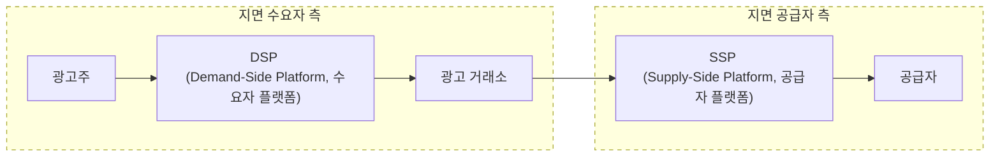
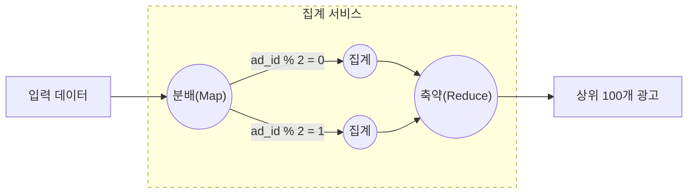

온라인 광고의 핵심적 혜택은 실시간 데이터를 통해 광고 효과를 정량적으로 측정할 수 있다는 점이다.

디지털 광고의 핵심 프로세스는 RTB(Real-Time Bidding), 즉 실시간 경매라 부른다.   
이 경매 절차를 통해 광고가 나갈 지면(inventory)을 거래한다.



RTB 프로세스에서 속도는 중요하다.   
보통 1초 내에 모든 프로세스가 마무리되어야 하기 때문이다.

데이터의 정확성도 중요하다.   
광고 클릭 이벤트 집계는 온라인 광고가 얼마나 효율적이었는지 측정하는 데 결정적인 역할을 하며,   
결과적으로 광고주가 얼마나 많은 돈을 지불할지에 영향을 끼친다.

온라인 광고에 사용되는 핵심 지표로는 CTR(Click-Through Rate, 클릭률), CVR(Conversion Rate, 전환률) 등이 있으며,   
집계된 광고 클릭 데이터에 기반하여 계산한다.

# 1단계: 문제 이해 및 설계 범위 확정
```
입력된 데이터는 어떤 형태?
>> 여러 서버에 분산된 로그 파일
>> 클릭 이벤트는 수집될 때마다 이 로그 파일의 끝에 추가
>> 클릭 이벤트에는 ad_id, click_timestamp, user-id, ip, country 등의 속성이 있음

데이터의 양은 어느 정도?
>> 매일 10억 개의 광고 클릭이 발생하고, 광고는 2백 만 회 게재
>> 광고 클릭 이벤튼의 수는 매년 30%씩 증가

가장 중요하게 지원해야 할 질의?
>> 3가지 질의 지원
>> * 특정관고에 대한 지난 M분간의 클릭 이벤트 수
>> * 지난 1분간 가장 많이 클릭된 광고 100개. 질의 기간과 광고 수는 변경 가능해야 하며, 집계는 매분 이루어짐
>> * ip, user_id, country 등의 속성을 기준으로 상기 2개 질의 결과를 필터링 할 수 있어야 함

다음과 같은 경우의 엣지 케이스에 대해 걱정해야 하는지?
* 예상보다 늦게 도착하는 이벤트
* 중복된 이벤트
* 시스템 일부가 언제든지 다운될 수 있으므로 시스템 복구를 고려
>> 그런 점들 고려

지연 시간 요건은?
>> 모든 처리가 수 분 내에 이루어져야 함
>> RTB와 광고 클릭 집계의 지연 시간 요건은 매우 다르다는 점에 유의
>> RTB 지연 시간은 응답성 요구사항 때문에 일반적으로 1초 미만
>> 광고 클릭 이벤트 집계는 주로 광고 과금 및 보고에 사용되기 때문에 몇 분 정도의 지연은 허용
```

## 기능 요구사항
* 지난 M분 동안의 ad_id 클릭 수 집계
* 매분 가장 많이 클릭된 상위 100개 광고 아이디를 반환
* 다양한 속성에 따른 집계 필터링을 지원
* 데이터의 양은 페이스북이나 구글 규모

## 비기능 요구사항
* 집계 결과 정확성은 데이터가 RTB 및 광고 과금에 사용되므로 중요
* 지연되거나 중복된 이벤트를 적절히 처리할 수 있어야 함
* 견고성(reliability): 부분적인 장애는 감내할 수 있어야 함
* 지연 시간 요구사항: 전체 처리 시간은 최대 수 분을 넘지 않아야 함

## 개략적 추정
* DAU 수는 10억 명
* 각 사용자는 하루에 평균 1개 광고를 클릭한다고 가정
  * 하루에 10억 건의 광고 클릭 이벤트가 발생
* 광고 클릭 QPS = 10^9 이벤트/하루 10^5초 = 10,000
* 최대 광고 클릭 QPS는 평균 QPS의 다섯 배, 즉 50,000QPS로 가정
* 광고 클릭 이벤트 하나당 0.1KB의 저장 용량이 필요하다고 가정
  * 일일 저장소 요구량은 0.1KB X 10억 = 100GB이며, 월간 저장 용량 요구량은 대략 3TB

---

# 2단계: 개략적 설계안 제시 및 동의 구하기
## 질의 API 설계
API를 설계하는 목적은 클라이언트와 서버 간의 통신 규약을 만드는 것이다.

기능 요구사항은 아래와 같다.
* 지난 M분 동안 각 ad_id에 발생한 클릭 수 집계
* 지난 M분 동안 가장 많은 클릭이 발생한 상위 N개 ad_id 목록 반환
* 다양한 속성을 기준으로 집계 결과를 필터링하는 기능 지원

## 데이터 모델
| 구분    | 원시 데이터만 보관하는 방안                          | 집계 결과 데이터만 보관하는 방안                                                                           |
|-------|------------------------------------------|----------------------------------------------------------------------------------------------|
| 장점    | • 원본 데이터를 손실 없이 보관<br>• 데이터 필터링 및 재계산 지원 | • 데이터 용량 절감<br>• 빠른 질의 성능                                                                    |
| 단점    | • 막대한 데이터 용량<br>• 낮은 질의 성능               | • 데이터 손실 (원본 데이터가 아닌 계산/유도된 데이터를 저장하는 데서 오는 결과)<br>• 예: 10개의 원본 데이터가 1개의 집계 데이터로 집계/축약될 수 있음 |

둘 다 저장할 것을 추천한다.
* 문제가 발생하면 디버깅에 활용할 수 있도록 원시 데이터도 보관
  * 버그로 집계 데이터가 손상되면 버그 수정 후에 원시 데이터에서 집계 결과 재생성 가능
* 원시 데이터는 양이 엄청나므로 직접 질의하는 것은 비효율적
  * 집계 결과 데이터를 질의하는 것이 바람직
* 원시 데이터는 백업 데이터로 활용
  * 재계산을 하는 경우가 아니라면 일반적으로 원시 데이터를 질의할 필요 X
  * 오래된 원시 데이터는 냉동 저장소로 옮기면 비용 절감 가능
* 집계 결과 데이터는 활성 데이터 구실
  * 질의 성능을 높이기 위해 튜닝하는 것이 보통

## 올바른 DB 선택
올바를 DB를 선택하려면 다음과 같은 사항을 평가해야 한다.
* 데이터는 어떤 모습? 관계형 데이터? 문서 데이터? 이진 대형 객체(BLOB)?
* 작업 흐름이 읽기 중심인가 쓰기 중심인가? 둘 다인가?
* 트랜잭션을 지원해야 하는가?
* 질의 과정에서 SUM이나 COUNT 같은 온라인 분석 처리(OLAP) 함수를 많이 사용해야 하는가?

### 원시 데이터
일상 적인 작업을 위해서라면 원시 데이터는 질의할 필요가 없지만,   
데이터 과학자나 기계 학습 엔지니어가 사용자 반응 예측, 행동 타게팅, 관련성 피드백 등을 연구하는 경우에는 유용하다.

이 설계안이 다루는 시스템에서 발생하는 평균 쓰기 QPS는 10,00이고 최대 QPS는 50,000이기 때문에 이 시스템은 쓰기 중심 시스템이다.   
따라서 카산드라나 InfluxDB를 사용하는 것이 좀 더 바람직하다.   
ORC, Parquet, AVRO 같은 컬럼형 데이터 형식 가운데 하나를 사용하여 S3에 데이터를 저장하는 방법도 있다.

### 집계 데이터
본질적으로 시계열 데이터이며 이 데이터를 처리하는 워크플로는 읽기 연산과 쓰기 연산을 둘 다 많이 사용한다.   
각 광고에 대해 매 분마다 DB에 질의를 던져 고객에게 최신 집계 결과를 제시해야 하기 때문이다.   
대시보드를 자동으로 새로 고치거나, 적시에 알림을 날리는 데 유용하다.

총 200만 개의 광고가 있다고 했으므로 읽기 연산이 많이 발생할 수밖에 없고,   
데이터를 매 분 집계하고 그 결과를 기록하므로 쓰기 작업도 아주 빈번하게 이루어진다.

## 개략적 설계안
집계 워크플로에서 입력은 원시 데이터(무제한 데이터 스트림)이고, 출력은 집계 결과다.


### 비동기 처리
지금 제시한 설계안은 데이터를 동기식으로 처리한다.   
이런 방식은 생산자와 소비자 용량이 항상 같을 수는 없으므로 좋지 않다.

카프카 같은 메시지 큐를 도입하여 생산자와 소비자의 결합을 끊어,   
전체 프로세스는 비동기 방식으로 동작하게 되고, 생산자와 소비자의 규모를 독립적으로 확장해 나갈 수 있게 된다.


* 첫 번째 메시지 큐

  | ad_id | click_timestamp | user_id | ip   | country |
  |-------|-----------------|---------|------|---------|

* 두 번째 메시지 큐
  1. 분 단위로 집계된 광고 클릭 수

     | ad_id | click_minute | count |
     |-------|--------------|-------|
  2. 분 단위로 집계한, 가장 많이 클릭한 상위 N개 광고

     | update_time_minute | most_clicked_ads |
     |--------------------|------------------|

집계 결과를 DB에 바로 기록하지 않는 이유는 정확하게 한 번 데이터를 처리하기 위해(atomic commit) 카프카 같은 시스템을 두 번째 메시지 큐로 도입해야 하기 때문이다.

## 집계 서비스
광고 클릭 이벤트를 집계하는 좋은 방안 하나는 MapReduce 프레임워크를 사용하는 것이다.

MapReduce에 좋은 모델은 유향 비순환 그래프(directed acyclic graph, DAG)다.   
DAG 모델의 핵심은 시스템을 맵/집계/리듀스 노드 등의 작은 컴퓨팅 단위로 세분화하는 것이다.   
각 노드는 한 가지 작업만 처리하며, 처리 결과를 다음 노드에 인계한다.

### 맵 노드
map node는 데이터 출처에서 읽은 데이터를 필터링하고 변환하는 역할을 담당한다.



입력 데이터를 정리하거나 정규화해야 하는 경우에는 맵 노드가 필요하다.

맵 노드가 필요한 또 한가지 이유는 데이터가 생성되는 방식에 대한 제어권이 없는 경우에는 동일한 ad_id를 갖는 이벤트가 서로 다른 카프카 파티션에 입력될 수도 있다는 점이다.

### 집계 노드
집계 노드는 ad_id별 광고 클릭 이벤트 수를 매 분 메모리에서 집계한다.

맵리듀스 패러다임에서 사실 집계 노드는 리듀스 프로세스의 일부다.   
따라서 맵-집계-리듀스 프로세스는 실제로는 맵-리듀스-리듀스 프로세스라고도 할 수 있다.

### 리듀스 노드
리듀스 노드는 모든 '집계' 노드가 산출한 결과를 최종 결과로 축약한다.   


예를 들어 집계 노드 각각은 자기 관점에서 가장 많은 클릭이 발생한 광고 3개를 추려 리듀스 노드로 보낸다.   
리듀스 노드는 그 결과를 모아 최종적으로 3개의 광고만 남긴다.

DAG는 맵리듀스 패러다임을 표현하기 위한 모델이다.   
빅데이터를 입력으로 받아 병렬 분산 컴퓨팅 자원을 활용하여 빅데이터를 작은, 또는 일반적 크기 데이터로 변환할 수 있도록 설계된 모델이다.

이 모델의 중간 데이터는 메모리에 저장될 수 있으며,   
노드 간 통신은 TCP로 처리할 수도 있고(서로 다른 프로세스)   
공유 메모리로 처리할 수도 있다(서로 다른 스레드).

### 주요 사용 사례
주요 집계 사례를 지원하는 데 어떻게 활용될 수 있는지 살펴보자.
* 지난 M분간 ad_id에 발생한 클릭 이벤트 수 집계
* 지난 M분간 가장 많은 클릭이 발생한 상위 N개의 ad_id 집계
* 데이터 필터링


* **사례 1: 클릭 이벤트 수 집계**
  
    맵 노드는 시스템에 입력되는 이벤트를 ad_id % 3을 기준으로 분배하며, 이렇게 분배한 결과는 각 집계 노드가 집계한다.

    
    
* **사례 2: 가장 많이 클릭된 상위 N개 광고 반환**

    가장 많이 클릭된 상위 광고 3개를 가져오는 방법의 단순화된 설계안이다.   
    이 방안은 상위 N개 광고로도 확장될 수 있다.

    

* **사례 3: 데이터 필터링**
    
    국가에 따른 필터링을 ad001과 ad002에 대해 적용하면 아래 표와 같다.

    | ad_id | click_minute | country | count |
    |-------|--------------|---------|-------|
    | ad001 | 202101010001 | USA     | 100   |
    | ad001 | 202101010001 | GPB     | 200   |
    | ad001 | 202101010001 | others  | 3000  |
    | ad002 | 202101010001 | USA     | 10    |
    | ad002 | 202101010001 | GPB     | 25    |
    | ad002 | 202101010001 | others  | 12    |

    이런 기법을 스타 스키마라고 부르고, 데이터 웨어하우스에서 널리 쓰이는 기법으로, 필터링에 사용되는 필드는 차원이라 부른다.   
    장점은 아래와 같다.
  * 이해하기 쉽고 구축하기 간단
  * 기존 집계 서비스를 재사용하여 스타 스키마에 더 많은 차원을 생성 가능
    * 다른 추가 컴포넌트는 필요 X
  * 결과를 미리 계산해 두는 방식이므로, 필터링 기준에 따라 데이터에 빠르게 접근 가능

  이 접근법에는 많은 bucket과 레코드가 생성된다는 한계가 있고, 필터링 기준이 많을 경우 더더욱 그렇다.

---

# 3단계: 상세 설계
## 스트리밍 vs 일괄 처리
본 설계안은 스트림 처리와 일괄 처리 방식을 모두 사용한다.   

스트림 처리는 데이터를 오는 대로 처리하고 거의 실시간으로 집계된 결과를 생성하는 데 사용한다.   
일괄 처리는 이력 데이터를 백업하기 위해 활용한다.

일괄 및 스트리밍 처리 경로를 동시에 지원하는 시스템의 아키텍처를 람다(lambda)라고 부른다.   
람다 아키텍처의 단점은 두 가지 처리 경로를 지원하므로 관리해야 할 코드가 두 벌이라는 점이다.

카파 아키텍처는 일괄 처리와 스트리밍 처리 경로를 하나로 결합하여 이 문제를 해결한다.   
핵식 아이디어는 단일 스트림 처리 엔진을 사용하여 실시간 데이터 처리 및 끊임없는 데이터 재처리 문제를 모두 해결하는 것이다.


본 시스템의 개략적 설계안은 카파 아키텍처를 따른다.   
따라서 이력 데이터의 재처리도 실시간 집계 서비스를 거친다.

## 데이터 재계산
집계 서비스에 중대한 버그가 발생하면,   
발생 시점부터 원시 데이터를 다시 읽어 집계 데이터를 재계산하고 고쳐야 할 것이다.


1. 재계산 서비스는 원시 데이터 저장소에서 데이터를 검색한다.
2. 추출된 데이터는 전용 집계 서비스로 전송된다.
    * 전용 집계 서비스를 두는 것은 실시간 데이터 처리 과정이 과거 데이터 재처리 프로세스와 간섭하는 일을 막기 위해서다.
3. 집계 결과는 두 번째 메시지 큐로 전송되어 집계 결과 DB에 반영된다.

재계산 프로세스는 데이터 집계 서비스를 재사용하기는 하지만 처리 대상 데이터는 다른 곳에서 읽는다.   
즉, 원시 데이터를 직접 읽는다.

## 시간
집계를 하려면 타임스탬프가 필요하다.   
타임스탬프는 두 가지 다른 위치에서 만들어질 수 있다.

- 이벤트 시각: 광고 클릭이 발생한 시각
- 처리 시각: 집계 서버가 클릭 이벤트를 처리한 시스템 시각


네트워크 지연이나 비동기적 처리 환경 때문에 이벤트가 발생한 시각과 처리 시각 사이의 격차는 커질 수 있다.

이벤트 발생 시각을 이용하는 방안과 처리 시각을 이용하는 방안의 장단점을 고려해 적절한 결정을 내려야 한다.

| 구분        | 장점                                        | 단점                                                                                        |
|-----------|-------------------------------------------|-------------------------------------------------------------------------------------------|
| 이벤트 발생 시각 | 광고 클릭 시점을 정확히 아는 것은 클라이언트이므로 집계 결과가 보다 정확 | 클라이언트가 생성한 타임스탬프에 의존하는 방식이므로 클라이언트에 설정된 시각이 잘못되었거나 악성 사용자가 타임스탬프를 고의로 조작하는 문제에서 자유로울 수 없음 |
| 처리 시각     | 서버 타임스탬프가 클라이언트 타임스탬프보다 안정적               | 이벤트가 시스템에 도착한 시간보다 한참 뒤인 경우에는 집계 결과가 부정확해짐                                                |

데이터 정확도는 아주 중요하므로, 이벤트 발생 시각을 사용할 것을 추천한다.   
이 경우 시스템에 늦게 도착한 이벤트를 올바르게 처리하려면 어떻게 하는 것이 좋을까?   
'워터마크(watermark)'라는 기술을 일반적으로 사용한다.


워터마크는 집계 윈도의 확장으로 본다.   
이렇게 하면 집계 결과의 정확도를 높일 수 있다.

가령 15초 워터마크를 윈도마다 붙이면 윈도 1은 이벤트 2를 집계할 수 있고 윈도 3은 이벤트 5를 집계할 수 있게 된다.

워터마크 기법으로도 시간이 한참 흐른 후에 시스템에 도달하는 이벤트는 처리할 수 없다.   
발생할 확률이 낮은 이벤트 처리를 위해 시스템을 복잡하게 설계하면 투자 대비 효능(ROI)은 떨어진다.   
게다가 사소한 데이터 오류는 하루치 데이터 처리를 마감할 때 조정할 수 있다.

워터마크 기법에는 단점도 있음에 유의하자.   
즉, 워터마크를 사용하면 데이터의 정확도는 높아지지만 대기 시간이 늘어나 전반적인 지연 시간은 늘어난다.

## 집계 윈도
텀블링 윈도는 시간을 같은 크기의 겹치지 않는 구간으로 분할한다.   
따라서 매 분 발생한 클릭 이벤트를 집계하기에 아주 적합하다.(요구사항 1)


슬라이딩 윈도는 데이터 스트림을 슬라이딩하면서 같은 구간 안에 있는 이벤트를 집계한다.   
슬라이딩 윈도는 서로 겹칠 수 있다.   
따라서 본 시스템의 두 번째 요구사항, 즉 지난 M분간 가장 많이 클릭된 상위 N개 광고를 알아내기에 적합하다.


## 전달 보장
집계 결과는 과금 등에 활용될 수 있기 때문에 데이터의 정확성과 무결성이 아주 중요하다.   
시스템은 다음 질문에 답할 수 있어야 한다.

- 이벤트의 중복 처리를 어떻게 피할 수 있는가?
- 모든 이벤트의 처리를 어떻게 보장할 수 있는가?

카프카와 같은 MQ는 보통 세 가지 유형의 전달 방식을 지원한다.   
최대 한 번, 최소 한 번, 정확히 한 번.

### 어떤 전달 방식을 택할 것인가
약간의 중복은 괜찮다면 대체로 '최소 한 번'이 적절하다.

과금을 다루는 시스템이라면 '정확히 한 번' 방식을 권장한다.

<br />

**[데이터 중복 제거]**

가장 흔한 데이텀 품질 이슈 가운데 하나이다.

아래는 두 가지 흔한 사례이다.

- 클라이언트 측
  - 예를 들어, 한 클라이언트가 같은 이벤트를 여러 번 보내는 경우다.
  - 악의적인 의도로 전송되는 중복 이벤트를 처리하는 데는 광고 사기/위험 제어 컴포넌트가 적합하다.
- 서버 장애
  - 집계 도중에 집계 서비스 노드에서 장애가 발생했고 업스트림 서비스가 이벤트 메시지에 대해 응답을 받지 못했다면, 같은 이벤트가 다시 전송되어 재차 집계될 가능성이 있다.

아래 그림은 집계 서비스 노드에 발생한 장애의 결과로 중복 데이터가 생기는 과정을 보여준다.   
이 노드는 업스트림 카프카에 오프셋을 저장하여 데이터 소비 상태를 관리한다.


집계 서비스 노드에 장애가 생겨 6단계를 실행하지 못하면 100에서 110까지의 이벤트는 이미 다운스트림에 전송되었으나 새 오프셋은 업스트림 카프카에 반영되지 않았다.   
따라서 새로 복구된 집계 서비스 노드는 오프셋 100부터 이벤트를 다시 소비하려 할 것이고, 그 결과로 데이터 중복이 발생한다.

이 문제의 가장 간단한 해결책은 아래 그림과 같이 HDFS나 S3 같은 외부 파일 저장소에 오프셋을 기록하는 것이다.


하지만 이 방안에도 문제는 있다.

3단계에서 집계 서비스 노드는 외부 저장소에 보관된 마지막 오프셋이 100인 경우에만 오프셋 100부터 110까지의 이벤트를 처리한다.   
저장소에 저장된 오프셋이 110이었다면 오프셋 110 이전 이벤트는 전부 무시한다.

하지만 이 설계에는 큰 문제가 있다.

집계 결과를 다운스트림으로 전송하기 전에 오프셋을 HDFS/S3에 저장하고 있는데,   
만일 그 직후 집계 서비스 노드에 장애가 발생하여 4단계를 완료하지 못했다면?   
외부 저장소에 저장된 오프셋은 110이므로, 복구된 집계 서비스 노드는 100부터 110까지의 이벤트를 다시 처리할 시도는 하지 않는 것이다.

따라서 데이터 손실을 막으려면 다운스트림에서 집계 결과 수신 확인 응답을 받은 후에 오프셋에 저장해야 한다.


이 수정된 설계안에서는 5.1단계 실행 전에 집계 서비스 노드에 장애가 생기면 복구 후에 100부터 110까지의 이벤트를 다운스트림에 다시 보낼 수 있다.

이벤트를 정확하게 한 번만 처리하고 싶다면 4단계부터 6단계까지의 작업을 하나의 분산 트랜잭션에 넣어야 한다.   
분산 트랜잭션은 여러 노드에서 작동하는 트랜잭션으로, 그 안에서 실행하는 작업 가운데 하나라도 실패하면 모든 작업의 상태를 실행 전으로 되돌리게 된다.


## 시스템 규모 확장
### MQ의 규모 확장
- 생산자(producer): 생산자 인스턴스 수에는 제한을 두지 않으므로 확장성은 쉽게 달성 가능
- 소비자(consumer): 소비자 그룹 내의 재조정(rebalancing) 메커니즘은 노드 추가/삭제를 통해 그 규모를 쉽게 조정 가능

시스템에 수백 개 카프카 소비자가 있는 경우에는 재조정 작업 시간이 길어져서 수 분 이상 걸리게 될 수 있다.   
따라서 더 많은 소비자를 추가하는 작업은 시스템 사용량이 많지 않은 시간에 실행하여 영향을 최소화하는 것이 좋다.

**브로커(broker)**

- 해시 키
  - 같은 ad_id를 갖는 이벤트를 같은 카프카 파티션에 저장하기 위해 ad_id를 해시 키로 사용한다.
  - 그렇게 하면 집계 서비스는 같은 ad_id를 갖는 이벤트를 전부 같은 파티션에서 구독할 수 있다.
- 파티션의 수
  - 파티션의 수가 변하면 같은 ad_id를 갖는 이벤트가 다른 파티션에 기록되는 일이 생길 수 있다.
  - 따라서 사전에 충분한 파티션을 확보하여 프로덕션 환경에서 파티션의 수가 동적으로 늘어나는 일은 피하는 것이 좋다.
- 토픽의 물리적 샤딩
  - 보통 하나의 토픽만으로 충분한 경우는 거의 없다.
  - 지역에 따라 여러 토픽을 둘 수도 있고, 사업 유형에 따라 둘 수도 있다.
  - 장점
    - 데이터를 여러 토픽으로 나누면 시스템의 처리 대역폭을 높일 수 있다.
    - 단일 토픽에 대한 소비자의 수가 줄면 소비자 그룹의 재조정 시간도 단축된다.
  - 단점
    - 복잡성이 증가하고, 유지 관리 비용이 늘어난다.

### 집계 서비스의 규모 확장
집계 서비스는 본질적으로 맵리듀스 연산으로 구현된다고 설명했다.


집계 서비스의 규모는 노드의 추가/삭제를 통해 수평적으로 조정이 가능하다.

집계 서비스의 처리 대역폭을 높이려면 어떻게 할까?

- 방안 1: ad_id마다 별도의 처리 스레드를 두는 방안 (구현 쉬움)
- 방안 2: 집계 서비스 노드를 아파치 하둡 YARN 같은 자원 공급자에 배포하는 방식으로, 다중 프로세싱을 활용하는 방안 (고가용성으로 많이 쓰임)

### DB의 규모 확장
카산드라는 안정 해시와 유사한 방식으로 수평적인 규모 확장을 기본적으로 지원하고 있다.

데이터는 각 노드에 균등하게 분산한다.   
이때 사본도 적당한 수만큼 만들어 분산한다.   
각 노드는 해시 링 위의 특정 해시 값 구간의 데이터 보관을 담당하며, 다른 가상 노드의 데이터 사본도 보관한다.


클러스터에 새 노드를 추가하면 가상 노드 간의 균형은 자동으로 다시 조정된다.   
수동으로 샤딩을 조정하는 과정은 필요하지 않다.

## 핫스팟 문제
다른 서비스나 샤드보다 더 많은 데이터를 수신하는 서비스나 샤드를 핫스팟이라 부른다.

이벤트 파티션을 ad_id로 나누기 때문에, 어떤 집계 서비스 노드는 다른 노드보다 더 많은 광고 클릭 이벤트를 수신하게 될 것이고, 그러다 보면 서버 과부하 문제가 발생할 수 있다.

이 문제는 더 많은 집계 서비스 노드를 할당하여 완화할 수 있다.


1. 집계 서비스 노드에 300개 이벤트 도착
   - 한 노드가 감당할 수 있는 양은 100개이므로 초과
   - 따라서 자원 관리자에게 추가 자원을 신청
2. 자원 관리자는 해당 서비스 노드에 과부하가 걸리지 않도록, 추가 자원을 할당
3. 원래 집계 서비스 노드는 각 서비스 노드가 100개씩의 이벤트를 처리할 수 있도록 이벤트를 세 개 그룹으로 분할
4. 집계가 끝나 축약된 결과는 다시 원래 집계 서비스 노드에 기록

## 결함 내성
집계는 메모리에서 이루어지므로 집계 노드에 장애가 생기면 집계 결과도 손실된다.   
하지만 업스트림 카프카 브로커에서 이벤트를 다시 받아오면 그 숫자를 다시 만들어 낼 수 있다.

카프카 데이터를 원점부터 다시 재생하여 집계하면 시간이 오래 걸린다.   
그러니 업스트림 오프셋 같은 '시스템 상태'를 스냅숏으로 저장하고 마지막으로 저장된 상태부터 복구해 나가는 것이 바람직하다.


어떤 집계 서비스 노드 하나에 장애가 발생하면 해당 노드를 새 것으로 대체한 다음 마지막 스탭숏에서 데이터를 복구하면 된다.   
스냅숏을 마지막으로 찍은 후에 도착한 새로운 이벤트는, 새 집계 서비스 노드가 카프카 브로커에서 읽어가 다시 처리할 것이다.


## 데이터 모니터링 및 정확성
집계 결과는 RTB(Real-Time Bidding) 및 청구서 발행 목적으로 사용될 수 있다.   
그러므로 시스템이 정상적으로 동작하는지 모니터링하고 데이터 정확성을 보장하는 것은 아주 중요한 과제다.

### 지속적 모니터링
다음과 같은 지표는 지속적으로 모니터링해야 한다.
- 지연시간(latency)
  - 데이터를 처리하는 각 단계마다 지연시간이 추가될 수 있으므로, 시스템의 중요 부분마다 timestamp 추적이 가능하도록 해야 한다.
  - 기록된 timestamp 사이의 차이를 지연 시간 지표로 변환해서 모니터링하면 된다.
- MQ 크기
  - 큐의 크기가 갑자기 늘어난다면 더 많은 집계 서비스 노드를 추가해야 할 수 있다.
  - 카프카는 분산 커밋 로그 형태로 구현된 MQ이므로, 카프카를 사용하는 경우에는 레코드 처리 지연 지표를 대신 추적하면 된다.
- 집계 노드의 시스템 자원
  - CPU, 디스크, JVM 같은 것에 관계된 지표

### 조정
조정(reconciliation)은 다양한 데이터를 비교하여 데이터 무결성을 보증하는 기법을 일컫는다.


매일 각 파티션에 기록된 클릭 이벤트를 이벤트 발생 시각에 따라 정렬한 결과를 일괄 처리하여 만들어 낸 다음, 실시간 집계 결과와 비교한다.   
더 높은 정확도가 필요하다면 더 작은 집계 윈도를 사용하면 된다.

윈도 크기에 관계없이 일부 이벤트는 늦게 도착할 수 있으므로 배치 작업 결과가 실시간 집계 결과와 정확히 일치하지 않을 수도 있다.

## 대안적 설계안
광고 클릭 데이터를 Hive에 저장한 다음 빠른 질의는 ElasticSearch 계층을 얹어서 처리한다면,   
집계는 Clickhouse나 Druid 같은 OLAP DB를 통해 처리할 수 있을 것이다.


---

# 4단계: 마무리
광고 클릭 이벤트 집계 시스템은 전형적인 빅데이터 처리 시스템이다.


