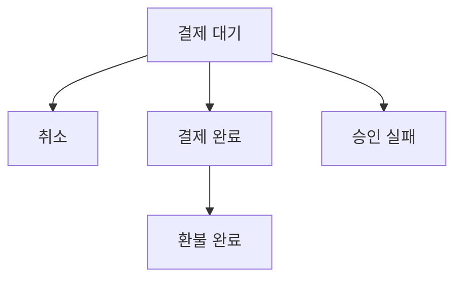

이 장에서 다루는 설계와 기법은 다른 인기 면접 문제에 활용될 수도 있다.
- 에어비엔비 시스템 설계
- 항공권 에약 시스템 설계
- 영화 티켓 예매 시스템 설계

# 1단계: 문제 이해 및 설계 범위 확정

```
시스템 규모는?
>> 5000개 호텔에 100만 개 객실을 갖춘 호텔 체인을 위한 웹사이트를 구축한다고 가정

대금은 예약 시 지불? 아니면 호텔에 도착했을 때 지불?
>> 시간 제한이 있으니 예약할 때 전부 지불

고객은 객실을 호텔의 웹사이트에서만 예약 가능? 아니면 전화 같은 다른 시스템으로도 가능?
>> 호텔 웹사이트나 앱에서만 가능하다고 가정

예약 취소 가능?
>> 물론

고려할 다른 사항은?
>> 10% 초과 예약 가능
>> 호텔은 일부 고객이 예약을 취소할 것을 예상하여 초과 예약을 허용하곤 함

시간이 제한되어 있으므로, 객실 검색은 범위에 포함X
다음과 같은 사항에만 집중
    - 호텔 정보 페이지 표시
    - 객실 정보 페이지 표시
    - 객실 예약 지원
    - 호텔이나 객실 정보를 추가/삭제/갱신하는 관리자 페이지 지원
    - 초과 예약 지원
>> 굳

>> 객실 가격은 유동적
>> 그날 객실에 여유가 얼마나 있는지에 따라 달라지고, 매일 달라질 수 있다고 가정
유념
```

## 비기능 요구사항
- 높은 수준의 동시성 지원
  - 성수기, 대규모 이벤트 기간에는 일부 인기 호텔의 특정 객실을 예약하려는 고객이 많이 몰릴 수 있음
- 적절한 지연 시간
  - 사용자가 예약을 할 때는 응답 시간이 빠르면 이상적이겠으나 예약 요청 처리에 몇 초 정도 걸리는 것은 괜찮음

## 개략적 규모 추정
- 총 5000개 호텔, 100만 개의 객실 가정
- 평균적으로 객실의 70% 사용 중, 평균 투숙 기간은 3일 가정
- 일일 예약 예약 건수: 1백만X0.7 / 3 = 233,333 =~ 240,000
- 초당 예약 건수 = 240,000 / 하루에 10^5초 =~ 3
  - 따라서 초당 예약 TPS는 그다지 높지 않음

시스템 내 모든 페이지의 QPS를 계산해 보자.   
일반적으로 고객이 이 웹사이트를 사용하는 흐름에는 세 가지 단계가 있다.
1. 호텔/객실 상세 페이지: 사용자가 호텔/객실 정보 확인 (조회 발생)
2. 예약 상세 정보 페이지: 사용자가 날짜, 투숙 인원, 결제 방법 등의 상세 정보를 예약 전에 확인 (조회 발생)
3. 객실 예약 페이지: 사용자가 '예약' 버튼을 눌러 객실을 예약 (트랜잭션 발생)

대략 10%의 사용자가 다음 단계로 진행하고 90%의 사용자가 최종 단계에 도달하기 전에 흐름을 이탈한다고 가정하면, 단계별 QPS는 아래 결과와 유사하다.


---

# 2단계: 개략적 설계안 제시 및 동의 구하기
## API 설계
- 호텔 관련 API
    - 호텔의 상세 정보 반환
    - 신규 호텔 추가, 호텔 직원만 사용 가능
    - 호텔 정보 갱신, 호텔 직원만 사용 가능
    - 호텔 정보 삭제, 호텔 직원만 사용 가능
- 객실 관련 API
    - 객실 상세 정보 반환
    - 신규 객실 추가, 호텔 직원만 사용 가능
    - 객실 정보 갱신, 호텔 직원만 사용 가능
    - 객실 정보 삭제, 호텔 직원만 사용 가능
- 예약 관련 API
    - 로그인 사용자의 예약 이력 반환
    - 특정 예약의 상세 정보 반환
    - 신규 예약
    - 예약 취소

신규 예약 접수는 아주 중요한 기능이다.   
reservationID는 이중 예약을 방지하고 동일한 예약은 단 한 번만 이루어지도록 보증하는 멱등 키(idempotent key)다.

```json
{
    "startDate": "2021-04-28",
    "endDate": "2021-04-30",
    "hotelID": "245",
    "roomID": "U12345673389",
    "reservationID": "13422445"
}
```

## 데이터 모델
어떤 DB를 사용할지 결정하기 전에 데이터 접근 패턴부터 자세히 살펴보자.   
호텔 예약 시스템은 다음 질의를 지원해야 한다.
1. 호텔 상세 정보 확인
2. 지정된 날짜 범위에 사용 가능한 객실 유형 확인
3. 예약 정보 기록
4. 예약 내역 또는 과거 예약 이력 정보 조회

대략적인 추정 과정을 통해 시스템 규모가 크지 않은 것은 알았으나 대규모 이벤트가 있는 경우에는 트래픽이 급증할 수도 있으니 대비해야 한다.   
이런 요구사항을 종합적으로 고려했을 때 본 설계안에서는 RDB를 선택할 것이다.   
이유는 다음과 같다.

- RDB는 읽기 빈도가 쓰기 연산에 비해 높은 작업 흐름을 잘 지원
  - 호텔 웹사이트/앱을 방문하는 사용자의 수는 실제로 객실을 예약하는 사용자에 비해 압도적으로 많음
  - NoSQL DB는 대체로 쓰기 연산에 최적화
  - RDB는 읽기가 압도적인 작업 흐름은 충분히 잘 지원
- RDB는 ACID 속성(원자성, 일관성, 격리성, 영속성)을 보장
  - ACID 속성은 예약 시스템을 만드는 경우 중요
  - 이 속성이 만족되지 않으면 잔액이 마이너스가 되는 문제, 이중 청구 문제, 이중 예약 문제 등 방지 어려움
  - ACID 속성이 충족되는 DB를 사용하면 애플리케이션 코드는 훨씬 단순해지고 이해하기 쉬워짐
  - RDB는 일반적으로 ACID 속성 보장
- RDB를 사용하면 데이터를 쉽게 모델링 가능
  - 비즈니스 데이터의 구조를 명확하게 표현할 수 있을 뿐 아니라 엔티티(호텔, 객실, 객실 유형 등) 간의 관계를 안정적으로 지원 가능

많은 지원자가 호텔 예약 시스템을 설계할 때 선택하는 가장 자연스럽고 단순하게 설계한 스키마를 살펴보자.


status 필드는 pending(결제 대기), paid(결제 완료), refunded(환불 완료), canceled(취소), rejected(승인 실패)의 다섯 상태 가운데 하나를 값으로 가질 수 있다.   
이를 상태 천이도 다이어그램으로 표현하면 아래와 같다.


이 스키마 디자인에는 문제가 있다.   
room_id가 있으므로 에어비앤비 같은 회사에는 적합하지만, 호텔의 경우에는 그렇지 않다.   
사용자는 특정 객실을 예약하는 것이 아니라 특정 호텔의 특정 객실 유형을 예약하기 때문이다.

객실 번호는 예약할 때가 아닌, 투숙객이 체크인 하는 시점에 부여된다.

## 개략적 설계안
이 호텔 예약 시스템에는 MSA를 사용한다.


- 사용자
  - 휴대폰이나 컴퓨터로 객실을 예약하는 당사자
- 관리자(호텔 직원)
  - 고객 환불, 예약 취소, 객실 정보 갱신 등의 관리 작업을 수행할 권한이 잇는 호텔 직원
- CDN
  - JS code bundle, 이미지, 동영상, HTML 등 모든 정적 콘텐츠를 캐시
  - 웹사이트 로드 성능 개선
- 공개 API 게이트웨이
  - 처리율 제한, 인증 등의 기능을 지원하는 완전 관리형 서비스
  - 엔드포인트 기반으로 특정 서비스에 요청을 전달할 수 있도록 구성됨
- 내부 API 
  - 승인된 호텔 직원만 사용 가능한 API
  - 내부 소프트웨어나 웹사이트를 통해서 사용 가능
  - VPN 등의 기술을 사용해 외부 공격으로부터 보호
- 호텔 서비스
  - 호텔과 객실에 대한 상세 정보 제공
  - 호텔과 객실 데이터는 일반적으로 정적이라서 쉽게 캐시 가능
- 요금 서비스
  - 미래의 어떤 날에 어떤 요금을 받아야 하는지 데이터를 제공하는 서비스
  - 재미있는 것은 객실의 요금은 해당 날짜에 호텔에 얼마나 많은 손님이 몰리느냐에 따라 달라짐
- 예약 서비스
  - 예약 요청을 받고 객실을 예약하는 과정을 처리
  - 객실이 예약되거나 취소될 때 잔여 객실 정보를 갱신하는 역할도 담당
- 결제 서비스
  - 고객의 결제를 맡아 처리하고, 절차가 성공적으로 마무리되면 예약 상태를 결제 완료로 갱신
  - 실패한 경우에는 승인 실패로 업데이트
- 호텔 관리 서비스
  - 승인된 호텔 직원만 사용 가능한 서비스
  - 임박한 예약 기록 확인, 고객 객실 예약, 예약 취소 등의 기능 제공

예약 서비스는 총 객실 요금을 계산하기 위해 요금 서비스에 질의할 필요가 있으므로,   
예약 서비스와 요금 서비스 사이에는 화살표가 있어야 한다.


---

# 3단계: 상세 설계

## 개선된 데이터 모델
호텔 객실을 예약할 때는 틀정 객실이 아니라 특정한 객실 유형을 예약하게 된다.   
이 요구사항을 수용하려면 API와 스키마의 어떤 부분을 변경하는 것이 좋을까?

roomID는 roomTypeID로 변경한다.

```json
{
    "startDate": "2021-04-28",
    "endDate": "2021-04-30",
    "hotelID": "245",
    "roomTypeID": "U12345673389",
    "reservationID": "13422445"
}
```


가장 중요하게 바뀐 부분은 다음과 같다.
- room: 객실에 관계된 정보
- room_type_rate: 특정 객실 유형의 특정 일자 요금 정보
- reservation: 투숙객 예약 정보
- room_type_inventory: 호텔의 모든 객실 유형을 담는 테이블 (예약 시스템에 아주 중요)
  - hotel_id: 호텔 식별자
  - room_type_id: 객실 유형 식별자
  - date: 일자
  - total_inventory: 총 객실 수에서 일시적으로 제외한 객실 수를 뺀 값 (일부 객실은 유지보수를 위해 예약 가능 목록에서 빼 둘수 있어야 함)
  - total_reserved: 지정된 hotel_id, room_type_id, date에 예약된 모든 객실의 수


