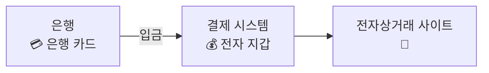
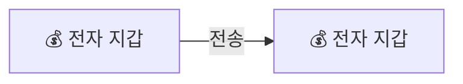

결제 플랫폼은 일반적으로 고객에서 전자 지갑 서비스를 제공하여 고객으로 하여금 지갑에 돈을 넣어 두고 필요할 때 사용할 수 있도록 한다.

은행 카드에서 전자 지갑에 돈을 이체해 두면 전자상거래 사이트에서 제품을 구매할 때 그 지갑의 돈을 사용하여 결제하는 옵션을 선택할 수 있다.



전자 지갑은 결제 기능만 제공하는 것이 아니다.   
일례로 페이팔은 같은 플랫폼의 다른 사용자 지갑으로 직접 송금을 지원한다.   
전자 지갑 간 이체는 은행 간 이체보다 빠르며, 일반적으로 추가 수수료를 부과하지 않는다는 중요한 차이가 있다.



지갑 간 이체를 지원하는 전자 지갑 애플리케이션의 백엔드를 설계해 보자.

# 1단계: 문제 이해 및 설계 범위 확정
```
두 전자 지갑 사이의 이체에만 집중? 다른 기능도 신경 써야 하는지
>> 이체 기능에만 집중

시스템이 지원해야 하는 TPS는?
>> 1,000,000TPS로 가정

전자 지갑은 정확성에 대한 엄격한 요건이 있을 텐데, DB가 제공하는 트랜잭션 보증이면 충분?
>> 네

정확성을 증명해야 하나요?
>> 일반적으로 정확성은 트랜잭션이 완료된 뒤에나 확인 가능
>> 한 가지 검증 방법은 내부 기록과 은행의 명세서를 비교
>> 그러나 이런 조정 작업으로는 데이터 일관성이 깨졌다는 사실은 알 수 있지만 그 차이가 왜 발생했는지는 모름
>> 따라서 재현성을 갖춘 시스템을 설계
>> 즉, 처음부터 데이터를 재생하여 언제든지 과거 잔액을 재구성할 수 있는 시스템 구축

가용성 요구사항이 99.99%라고 가정?
>> 네

환전 가능?
>> no
```

## 개략적 추정
TPS를 거론한다는 것은 배후에 트랜잭션 기반 DB를 사용한다는 뜻이다.

일반적인 데이터센터 노드에서 실행되는 RDB는 초당 수천 건의 트랜잭션을 지원할 수 있다.

본 설계안에서 사용할 DB 노드는 1,000TPS 지원을 한다고 가정한다.   
따라서 1백만 TPS를 지원하려면 1,000개의 DB 노드가 필요하다.

해당 계산은 부정확하므로, 이체 명령 실행 시 두 번의 연산이 필요하다.   
1백만 건의 TPS를 처리하기 위해서는 2백만 TPS를 지원해야 하고, 결국 2000개 노드가 필요하다.

---

# 2단계: 개략적 설계안 제시 및 동의 구하기

## 인메모리 샤딩
지갑 애플리케이션은 모든 사용자 계정의 잔액을 유지한다.

레디스 노드 한 대로 100만 TPS 처리는 벅차다.   
클러스터를 구성하고 사용자 계정을 모든 노드에 균등하게 분산시켜야 한다.   
이 절차를 파티셔닝 또는 샤딩이라고 한다.

모든 레디스 노드의 파티션 수 및 주소는 한군데 저장해 둔다.   
높은 가용성을 보장하는 설정 정보 전문 저장소 주키퍼를 이 용도로 쓰면 좋다.   
이 방안의 마지막 구성 요소는 이체 명령 처리를 담당하는 서비스로, 지갑 서비스로 부르겠다.

지갑 서비스는 다음의 중요한 역할을 담당한다.
1. 이체 명령의 수신
2. 이체 명령의 유효성 검증
3. 명령이 유효한 것으로 확인되면 이체에 관계된 두 계정의 잔액 갱신
   - 이 두 계정은 서로 다른 레디스 노드에 존재 가능

이 서비스는 무상태 서비스다.   
따라서 수평적 규모 확장이 용이하다.


A, B, C라는 세 클라이언트가 있으며, 이들의 계정 잔액 정보는 이 세 개 레디스 노드에 균등하게 분산되어 있다.

```
이 설계에서는 계정 잔액이 여러 레디스 노드에 분산됩니다.
주키퍼는 샤딩 정보 관리에 사용합니다.
무상태 서비스인 지갑 서비스는 주키퍼에 샤딩 정보를 질의하여 특정 클라이언트의 정보를 담은 레디스 노드를 찾고, 그 잔액을 적절히 갱신합니다.

>> 이 설계는 작동은 하지만 정확성 요구사항을 충족하지 못합니다.
>> 지갑 서비스는 이체할 때마다 두 개의 레디스 노드를 업데이트하는데, 그 두 연산이 모두 성공하리라는 보장은 없다.

>> 예를 들어 첫 번째 업데이트를 끝낸 후 두 번째 업데이트를 완료하기 전에 지갑 서비스 노드가 죽어버리면 이체는 온전히 마무리되지 못한다.
>> 그러니 그 두 업데이트 연산은 하나의 원자적 트랜잭션으로 실행되어야 한다.
```

## 분산 트랜잭션
### DB 샤딩
서로 다른 두 개 저장소 노드를 갱신하는 연산을 원자적으로 수행하려면 어떻게 해야 할까?   
첫 번째 단계는 각 레디스 노드를 트랜잭션을 지원하는 RDB 노드로 교체하는 것이다.


클라이언트 A, B, C의 잔액 정보가 레디스 노드가 아닌 3개의 RDB 노드로 분산된다.

하지만 트랜잭션 DB를 사용해도 이런 식이면 문제의 일부만 해결할 수 있다.   
한 이체 명령이 서로 다른 두 DB 서버에 있는 계정 두 개를 업데이트해야 할 가능성이 아주 높은데,   
이 두 작업이 정확히 동시에 처리된다는 보장이 없다.

첫 번째 계정의 잔액을 갱신한 직후에 지갑 서비스가 재시작된 경우를 생각해 보자.   
두 번째 계정의 잔액도 반드시 갱신되도록 하려면 어떻게 해야 할까?

### 분산 트랜잭션: 2단계 커밋
분산 트랜잭션은 여러 노드의 프로세스를 원자적인 하나의 트랜잭션으로 묶는 방안이다.   
구현법으로는 저수준 방안과 고수준 방안 두 가지가 있다.

저수준 방안은 DB 자체에 의존하는 방안이다.   
이때 가장 일반적으로 사용되는 알고리즘은 2단계 커밋(2PC)이다.


1. 지갑 서비스는 정상적으로 여러 DB에 읽기 및 쓰기 작업을 수행
   - DB A와 C에 락 걸림
2. 애플리케이션이 트랜잭션을 커밋하려 할 때 지갑 서비스는 모든 DB에 트랜잭션 준비를 요청
3. 두 번째 단계에서 지갑 서비스는 모든 DB의 응답을 받아 다음 절차를 수행
   1. 모든 DB가 '예'라고 응답하면 지갑 서비스는 모든 DB에 해당 트랜잭션 커밋을 요청
   2. 어느 한 DB라도 '아니요'를 응답하면 조정자는 모든 DB에 트랜잭션 중단을 요청

이 방안이 저수준 방안인 이유는, 준비 단계를 실행하려면 DB 트랜잭션 실행 방식을 변경해야 하기 때문이다.   
예를 들어 이기종 DB 사이에 2PC를 실행하려면 모든 DB가 X/Open XA 표준을 만족해야 한다.

2PC의 가장 큰 문제점은 다른 노드의 메시지를 기다리는 동안 락이 오랫동안 잠긴 상태로 남을 수 있어서 성능이 좋지 않다는 것이다.   
또 다른 문제는 아래 그림처럼 지갑 서비스가 SPOF, 즉 단일 장애 지점이 될 수 있다는 것이다.


### 분산 트랜잭션: TC/C
TC/C(Try-Confirm/Cancel)는 두 단계로 구성된 보상 트랜잭션이다.

1. 지갑 서비스는 모든 DB에 트랜잭션에 필요한 자원 예약을 요청
2. 지갑 서비스는 모든 DB로부터 회신 응답
   1. 모두 '예'라고 응답하면 지갑 서비스는 모든 DB에 작업 확인을 요청하는데, 이것이 바로 'TC(시도-확정)' 절차
   2. 어느 하나라도 '아니요'라고 응답하면 지갑 서비스는 모든 DB에 작업 취소를 요청하며, 이것이 바로 'TC(시도-취소)' 절차

2PC는 두 단계는 한 트랜잭션이지만 TC/C에서는 각 단계가 별도 트랜잭션이라는 점에 유의하자.

#### TC/C 사례
| 단계   | 실행연산    | A                | C               |
|------|---------|------------------|-----------------|
| 1    | 시도      | 잔액 변경: -$1       | 아무것도 하지 않음      |
| 2    | 확인      | 아무것도 하지 않음       | 잔액 변경: +$1      |
| 2    | 취소      | 잔액 변경: +$1       | 아무것도 하지 않음      |

지갑 서비스가 TC/C의 조정자라고 가정하자.   
분산 트랜잭션이 시작될 때 계정 A의 잔액은 1달러이고 계정 C의 잔액은 0달러이다.

**첫 번째 단계: 시도**   
시도 단계에서는 조정자 역할을 하는 지갑 서비스가 두 개의 트랜잭션 명령을 두 DB로 전송한다.


1. 조정자는 계정 A가 포함된 DB에 A의 잔액을 1달러 감소시키는 트랜잭션을 시작
2. 조정자는 계정 C가 포함된 DB에는 아무 작업도 하지 않음
   - 조정자가 DB에 NOP(No Operation) 명령을 보낸다고 가정
   - DB는 NOP 명령에 대해 아무 작업도 수행하지 않으며 항상 성공했다는 응답 전송

**두 번째 단계: 확정**   
두 DB가 모두 예라고 응답하면 지갑 서비스는 확정 단계를 시작한다.


계정 A의 잔액은 이미 첫 번째 단계에서 갱신되었다.   
따라서 잔액을 변경할 필요가 없다.   
그러나 계정 C는 아직 $1를 받지 못했다.   
따라서 확인 단계에서 지갑 서비스는 계정 C의 잔액에 $1를 추가해야 한다.

**두 번째 단계: 취소**   
첫 번째 시도 단계가 실패하면 어떻게 해야 하나?   
분산 트랜잭션을 취소하고 관련된 자원을 반환해야 한다.


시도 단계의 트랜잭션에서 계전 A의 잔액은 이미 바뀌었고 트랜잭션은 종료되었다.   
이미 종료된 트랜잭션의 효과를 되돌리려면 지갑 서비스는 또 다른 트랜잭션을 시작하여 계정 A에 1달러를 다시 추가해야 한다.

시도 단계에서 계정 C의 잔액은 업데이트하지 않았으므로, 계정 C의 DB에는 NOP 명령을 전송하기만 하면 된다.

#### 2PC와 TC/C의 비교
| 구분   | 첫 번째 단계                      | 두 번째 단계: 성공           | 두 번째 단계: 실패                   |
|------|------------------------------|-----------------------|-------------------------------|
| 2PC  | 로컬 트랜잭션은 아직 완료되지 않은 상태       | 모든 로컬 트랜잭션을 커밋        | 모든 로컬 트랜잭션을 취소                |
| TC/C | 모든 로컬 트랜잭션이 커밋되거나 취소된 상태로 종료 | 필요한 경우 새 로컬 트랜잭션 실행   | 이미 커밋된 트랜잭션의 실행 결과를 되돌림(undo) |

#### 단계별 상태 테이블
TC/C 실행 도중에 지갑 서비스가 다시 시작되면 어떻게 되나?   

TC/C의 진행 상황, 특히 각 단계 상태 정ㅇ보를 트랜잭션 DB에 저장하면 된다.   
최소한 다음을 포함해야 한다.

- 분산 트랜잭션의 ID와 내용
- 각 DB에 대한 '시도(Try)' 단계의 상태
- 두 번째 단계의 이름
  - Confirm or Cancel
  - 시도 단계의 결과를 사용하여 계산 가능
- 두 번째 단계의 상태
- 순서가 어긋났음을 나타내는 플래그

단계별 상태 테이블은 일반적으로 돈을 인출할 지갑의 계정이 있는 DB에 둔다.


#### 불균형 상태
시도 단계가 끝나고 나면 계정 A에서는 1달러가 차감되고, 계정 C에는 변화가 없다.   
A와 C의 계정 잔액 합계는 $0이다.   
TC/C 시작 시점보다 적은 값이다.   
이는 **거래 후에도 잔액총합은 동일해야 한다는 회계 기본 원칙을 위반**한다.

트랜잭션 보증은 TC/C 방안에서도 여전히 유효하다.   
TC/C는 여러 개의 독립적인 로컬 트랜잭션으로 구성된다.   
TC/C는 실행 주체는 애플리케이션이며, 애플리케이션은 이런 독립적 로컬 트랜잭션이 만드는 중간 결과를 볼 수 있다.

반면, DB 트랜잭션이나 2PC 같은 분산 트랜잭션의 경우 실행 주체는 DB이며 애플리케이션은 그 중간 실행 결과를 알 수 없다.

분산 트랜잭션 실행 도중에는 항상 데이터 불일치가 발생한다.


#### 유효한 연산 순서
시도 단계에서 할 수 있는 일은 세 가지다.

| 선택지  | 계정 A | 계정 C |
|------|------|------|
| 선택 1 | -$1  | NOP  |
| 선택 2 | NOP  | +$1  |
| 선택 3 | -$1  | +$1  |

두 번째 선택지의 경우, 계정 C의 연산은 성공했으나 계정 A에서 실패한 경우(NOP) 지갑 서비스는 취소 단계를 실행해야 한다.   
그러나 취소 단계 실행 전에 누군가 C 계정에서 $1를 이미 이체했다면?   
나중에 지갑 서비스가 C에서 1달러를 차감하려고 하면 아무것도 남지 않은 것을 발견하게 된다.   
이는 분산 트랜잭션의 트랜잭션 보증을 위반하는 것이다.

세 번째 선택지의 경우, \$1를 A 계좌에서 차감하고 동시에 C에 추가하면 많은 문제가 발생할 수 있다.   
예를 들어 C 계좌에는 $1이 추가됐으나 A에서 해당 금액을 차감하는 연산은 실패했다면?   

따라서 두 번째와 세 번째 선택지는 유효하지 않다.   
첫 번째만 올바른 방법이다.

#### 잘못된 순서로 실행된 경우
TC/C에는 실행 순서가 어긋날 수 있다는 문제가 있다.

계정 A에서 계정 C로 1달러를 이체하는 예제를 활용해 보자.   
시도 단계에서 계정 A에 대한 작업이 실패하여 지갑 서비스에 실패를 반환한 다음 취소 단계로 진입하여 계정 A와 C 모두에 취소 명령을 전송한다.   
이때 계정 C를 관리하는 DB에 네트워크 문제가 있어서 시도 명령 전에 취소 명령부터 받게 되었을 시점에는 취소할 것이 없는 상태다.


순서가 바뀌어 도착하는 명령도 처리할 수 있도록 하려면 기존 로직을 다음과 같이 수정하면 된다.
- 취소 명령이 먼저 도착하면 DB에 아직 상응하는 시도 명령을 못보았음을 나타내는 플래그를 참으로 설정하여 저장
- 시도 명령이 도착하면 항상 먼저 도착한 취소 명령이 있었는지 확인하고, 있었으면 바로 실패를 반환

### 분산 트랜잭션: 사가
#### 선형적 명령 수행
사가(Saga)는 유명한 분산 트랜잭션 솔류션 가운데 하나로 MSA에서는 사실상 표준이다.

1. 모든 연산은 순서대로 정렬되고, 각 연산은 자기 DB에 독립 트랜잭션으로 실행
2. 연산은 첫 번째부터 마지막까지 순서대로 실행되고, 한 여산이 완료되면 다음 연산 개시
3. 연산이 실패하면 전체 프로세스는 실패한 연산부터 맨 처음 연산까지 역순으로 보상 트랜잭션을 통해 롤백
   - n개의 연산을 실행하는 분산 트랜잭션은, 보상 트랜잭션을 위한 n개 연산까지 총 2n개의 연산을 준비


계정 A에서 C로 $1를 이체하는 작업 흐름이다.   
맨 위쪽 가로줄은 일반적인 실행 순서다.   
한편 두 개의 수직선은 오류가 발생했을 때 시스템이 해야 하는 작업이다.   
오류가 발생하면 이체는 롤백되고 클라이언트는 오류 메시지를 받는다.   
**입금 전에 인출부터 해야 한다.**

연산 실행 순서는 두 가지 방법으로 조율할 수 있다.
1. 분산 조율(Choreography)
   - MSA에서 사가 분산 트랜잭션에 관련된 모든 서비스가 다른 서비스의 이벤트를 구독하여 작업을 수행하는 방식
   - 완전 탈 중앙화된 조율 방식
2. 중앙 집중형 조율(Orchestration)
   - 하나의 조정자(coordinator)가 모든 서비스가 올바른 순서로 작업을 실행하도록 조율

#### TC/C vs 사가

|                     | TC/C    | 사가                 |
|---------------------|---------|--------------------|
| 보상 트랜잭션 실행          | 취소 단계에서 | 롤백 단계에서            |
| 중앙 조정               | 예       | 예(중앙 집중형 조율 모드에서만) |
| 작업 실행 순서            | 임의      | 선형                 |
| 병렬 실행 가능성           | 예       | 아니오(선형적 실행)        |
| 일시적으로 일관되지 않은 상태 허용 | 예       | 예                  |
| 구현 계층: 애플리케이션 또는 DB | 애플리케이션  | 애플리케이션             |

실무에서는 지연 시간(latency) 요구사항에 따라 다르다.
1. 지연 시간 요구사항이 없거나 앞서 살펴본 송금 사례처럼 서비스 수가 매우 적다면 아무것이나 사용
   - MSA에서 흔히 하는 대로 하고 싶다면 사가 선택
2. 지연 시간에 민감하고 많은 서비스/운영이 관계된 시스템이라면 TC/C

```
잔액 이체를 원자적 트랜잭션으로 처리하려면 레디스를 RDB로 다체하고 TC/C 또는 사가를 사용하여 분산 트랜잭션을 구현
>> 좋은 생각

>> 분산 트랜잭션 방안도 제대로 작동하지 않는 경우 존재
>> 사용자가 애플리케이션 수준에서 잘못된 작업을 입력
>> 문제의 근본 원인을 역추적하고 모든 계정에서 발생하는 연산을 감사할 방법이 있으면 좋을 듯
```

## 이벤트 소싱
### 배경
실제로 전자 지갑 서비스 제공 업체도 감사를 받을 수 있고, 아래와 같은 까다로운 질문들을 던질 수 있다.
1. 특정 시점의 계정 잔액을 알 수 있나요?
2. 과거 및 현재 계정 잔액이 정확한지 어떻게 알 수 있나요?
3. 코드 변경 후에도 시스템 로직이 올바른지는 어떻게 검증하나요?

이러한 질문에 체계적으로 답할 수 있는 설계 철학 중 하나는 DDD에서 개발된 기법인 **이벤트 소싱**이다.

### 정의
이벤트 소싱에는 네 가지 중요한 용어가 있다.

#### 명령(command)
명령은 외부에서 전달된, 의도가 명확한 요청이다.

이벤트 소싱에서 순서는 아주 중요하다.   
따라서 명령은 일반적으로 FIFO 큐에 저장된다.

#### 이벤트(event)
명령은 의도가 명확하지만 사실은 아니기 때문에 유효하지 않을 수도 있다.

작업 이행 전에는 반드시 명령의 유효성을 검사해야 하고, 검사를 통과한 명령은 반드시 이행되어야 한다.   
명령 이행 결과를 이벤트라고 부르낟.

명령과 이벤트 사이에는 두 가지 중요한 차이점이 있다.
1. 이벤트는 검증된 사실로, 실행이 끝난 상태
   - 이벤트에 대해 이야기할 때는 과거 시제를 사용
   - 명령이 "A에서 C로 $1 송금"인 경우, 해당 이벤트는 "A에서 C로 $1 송금을 완료하였음"
2. 명령에는 무작위성이나 I/O가 포함될 수 있지만 이벤트는 결정론적
   - 이벤트는 과거에 실제로 있었던 일

이벤트 생성 프로세스에는 두 가지 중요한 특성이 있다.
1. 하나의 명령으로 여러 이벤트 생성 가능
2. 이벤트 생성 과정에는 무작위성이 개입될 수 있어서, 같은 명령에 항상 동일한 이벤트들이 만들어진다는 보장X
   - 이벤트 생성 과정에는 외부 I/O 또는 난수 개입 가능

이벤트 수서는 명령 순서를 따라야 한다.   
따라서 이벤트도 FIFO 큐에 저장한다.

#### 상태(state)
상태는 이벤트가 적용될 때 변경되는 내용이다.

#### 상태 기계(state machine)
상태 기계는 이벤트 소싱 프로세스를 구동한다.
1. 명령의 유효성을 검사하고 이벤트를 생성
2. 이벤트를 적용하여 상태를 갱신

이벤트 소싱을 위한 상태 기계는 결정론적으로 동작해야 한다.   
따라서 무작위성을 내포할 수 없다.

아래 그림은 이벤트 소싱 아키텍처를 정적으로 표현한 것이다.   
명령을 이벤트로 변환하고 이벤트를 적용하는 두 가지 기능을 지원해야 하므로, 명령 유효성 검사를 위한 상태 기계 하나와 이벤트 적용을 위한 상태 기계 하나를 두었다.


여기에 시간을 하나의 차원으로 추가하면 아래와 같은 동적 관점으로도 표현할 수 있다.   
명령을 수신하고 처리하는 과정을 계속 반복하는 시스템이다.


### 지갑 서비스 예시
지갑 서비스의 경우 명령은 이체 요청일 것이다.   
명령은 FIFO 큐에 기록하며, 큐로는 카프카를 널리 사용한다.


상태, 즉 계정 잔액은 RDB에 있다고 가정하자.   
상태 기계는 명령을 큐에 들어간 순서대로 확인한다.   
명령 하나를 읽을 때마다 계정에 충분한 잔액이 있는지 확인한다.   
충분하다면 상태 기계는 각 계정에 대한 이벤트를 만든다.   
예를 들어 명령이 "A -> \$1 -> C"라면 상태 기계는 "A: -\$1"과 "C: +$1"의 두 이벤트를 만든다.

상태 기계는 다섯 단계로 동작한다.
1. 명령 대기열에서 명령 읽기
2. DB에서 잔액 상태 읽기
3. 명령의 유효성을 검사하고, 유효하면 계정별로 이벤트 생성
4. 다음 이벤트 읽기
5. DB의 잔액을 갱신하여 이벤트 적용 마침


### 재현성
이벤트를 처음부터 다시 재생하면 과거 잔액 상태는 언제든 재구성할 수 있다.

이벤트 리스트는 불변이고 상태 기계 로직은 결정론적이므로 이벤트 이력을 재생하여 만들어낸 상태는 언제나 동일하다.


재현성을 갖추면 까다로운 질문에 쉽게 답할 수 있다.
1. 특정 시점의 계정 잔액을 알 수 있나요?
   - 시작부터 계정 잔액을 알고 싶은 시점까지 이벤트를 재생하면 알 수 있다.
2. 과거 및 현재 계정 잔액이 정확한지는 어떻게 알 수 있나요?
   - 이벤트 이력에서 계정 잔액을 다시 계산해 보면 잔액이 정확한지 확인할 수 있다.
3. 코드 변경 후에도 시스템 로직이 올바른지는 어떻게 증명할 수 있나요?
   - 새로운 코드에 동일한 이벤트 이력을 입력으로 주고 같은 결과가 나오는지 보면 된다.

### 명령-질의 책임 분리(CQRS)
클라이언트는 여전히 계정 잔액을 알 수 없다.   
이벤트 소싱 프레임워크 외부의 클라이언트가 상태(잔액)를 알도록 할 방법이 필요하다.

직관적인 해결책 하나는 상태 이력 DB의 읽기 전용 사본을 생성한 다음 외부와 공유하는 것이다.

이벤트 소싱은 상태, 즉 계정 잔액을 공개하는 대신 모든 이벤트를 외부에 보낸다.   
따라서 이벤트를 수신하는 외부 주체가 직접 상태를 재구축할 수 있다.   
이런 설계 철학을 명령-질의 책임 분리(Command-Query Responsibility Separation)라고 한다.

CQRS에서는 상태 기록을 담당하는 상태 기계는 하나고, 읽기 전용 상태 기계는 여러 개 있을 수 있다.   
읽기 전용 상태 기계는 상태 뷰를 만들고, 이 뷰는 질의(query)에 이용된다.

읽기 전용 상태 기계는 실제 상태에 어느 정도 뒤쳐질 수 있으나 결국에는 같아진다.   
따라서 결과적 일관성 모델을 따른다 할 수 있다.


```
이벤트 소싱 아키텍처를 사용하면 전체 시스템에 재현성을 확보할 수 있다.
모든 유효한 사업 기록은 변경이 불가능ㅇ한 이벤트 대기열에 저장되어, 정확성 검증에 사용될 수 있다.

>> 이벤트 소싱 아키텍처는 한 번에 하나의 이벤트만 처리하는 데다 여러 외부 시스템과 통신해야 한다.
>> 더 빠르게 만들 수 있는가
```

---

# 3단계: 상세 설계
## 고성능 이벤트 소싱
카프카를 명령 및 이벤트 저장소로, DB를 상태 저장소로 사용했다.   
가능한 몇 가지 최적화 방안을 살펴보자.

### 파일 기반의 명령 및 이벤트 목록
명령과 이벤트를 카프카 같은 원격 저장소가 아닌 로컬 디스크에 저장하는 방안을 생각해 볼 수 있다.   
이렇게 하면 네트워크를 통한 전송 시간을 피할 수 있다.   
이벤트 목록은 추가 연산만 가능한 자료 구조에 저장한다.   
추가는 순차적 쓰기 연산으로, 일반적으로 매우 빠르다.

운영체제는 보통 순차적 읽기 및 쓰기 연산에 엄청나게 최적화되어 있기 때문에 HDD에서도 잘 작동한다.   
순차적 디스크 접근은 경우에 따라서는 무작위 메모리 접근보다도 빠르게 실행될 수 있다.

최근 명령과 이벤트를 메모리에 캐시하는 방안도 생각해 볼 수 있다.   
앞서 설명했듯 명령과 이벤트는 지속성 저장소에 보관된 이후에 처리된다.   
**메모리에 캐시해 놓으면 로컬 디스크에서 다시 로드하지 않아도 된다.**

mmap을 사용하면 로컬 디스크에 쓰는 동시에, 최근 데이터는 메모리에 자동으로 캐시할 수 있다.   
mmap은 디스크 파일을 메모리 배열에 대응시킨다.   
운영체제는 파일의 특정 부분을 메모리에 캐시하여 읽기 및 쓰기 연산의 속도를 높인다.   
추가만 가능한 파일에 이루어지는 연산의 경우 필요한 모든 데이터는 거의 항상 메모리에 있으므로 실행 속도를 높일 수 있다.

아래 그림은 파일 기반의 명령 및 이벤트 저장소를 보여 준다.


### 파일 기반 상태
파일 기반 로컬 RDB SQLite를 사용하거나, 로컬 파일 기반 키-값 저장소 RocksDB를 사용할 수 있다.

여기서는 RocksDB를 사용하는데, 쓰기 작업에 최적화된 자료구조 LSM(Log-Structured Merge-tree)를 사용하여 최근 데이터를 캐시해서 읽기 성능을 높인다. 

아래 그림은 명령, 이벤트 및 상태 저장에 파일 기반 솔루션을 적용한 아키텍처다.


### 스냅숏
스냅숏은 과거 특정 시점의 상태로, 변경이 불가능하다.   
스냅숏을 저장하고 나면 상태 기계는 더 이상 최초 이벤트에서 시작할 필요가 없다.   
스냅숏을 읽고, 어느 시점에 만들어졌는지 확인한 다음, 그 시점부터 이벤트 처리를 시작하면 된다.

CQRS로 처음부터 해당 시점까지 모든 이벤트를 순서대로 처리하는 읽기 전용 상태 기계를 사용해야 했다.   
스냅숏을 사용하면 읽기 전용 상태 기계는 해당 데이터가 포함된 스냅숏 하나만 로드하면 된다.

스냅숏은 거대한 이진 파일이며, 일반적으로는 HDFS와 같은 객체 저장소에 저장한다.

아래 그림은 파일 기반의 이벤트 소싱 아키텍처를 보여 준다.   
모든 것이 파일 기반일 때 시스템은 컴퓨터 하드웨어의 I/O 처리량을 그 한계까지 최대로 활용할 수 있다.


```
명령 목록, 이벤트 목록, 상태, 스냅숏이 모두 파일에 저장되도록 이벤트 소싱 아키텍처를 변경할 수 있다.
이벤트 소싱 아키텍처는 애초에 이벤트 목록을 선형적으로 처리하므로 HDD나 운영체제 캐시와 궁합이 잘 맞다.

>> 로컬 파일 기반 솔루션의 성능은 원격 카프카나 DB에 저장된 데이터를 액세스하는 시스템보다는 좋다고 할 수 있다.
>> 하지만 로컬 디스크에 데이터를 저장하는 서버는 더 이상 무상태 서버가 아닌데다, 단일 장애 지점이 된다는 문제가 있다.
>> 시스템의 안정성은 어떻게 개선할 수 있을까?
```

## 신뢰할 수 잇는 고성능 이벤트 소싱
시스템의 어느 부분에 신뢰성 보장이 필요한지 살펴보자.

### 신뢰성 분석
지금 설계하고 있는 시스템에는 네 가지 유형의 데이터가 있다.
1. 파일 기반 명령
2. 파일 기반 이벤트
3. 파일 기반 상태
4. 상태 스냅숏

각각의 신뢰성 보장 방법을 살펴보자.

상태와 스냅숏은 이벤트 목록을 재생하면 언제든 다시 만들 수 있다.   
그러니 상태 및 스냅숏의 안정성을 향상시키려면 이벤트 목록의 신뢰성만 보장하면 된다.

이벤트 생성은 결정론적 과정이 아니며, 난수나 외부 입출력 등의 무작위적 요소가 포함될 수 있다.   
따라서 명령의 신뢰성 만으로는 이벤트의 재현성을 보장할 수 없다.

이벤트는 상태(즉, 잔액)에 변화를 가져 오는 과거의 사실이다.   
이벤트는 불변이며 상태 재구성에 사용할 수 있다.   
따라서 높은 신뢰성을 보장할 유일한 데이터는 이벤트다.

### 합의
높은 안정성을 제공하려면 이벤트 목록을 여러 노드에 복제해야 한다.   
복제 과정은 다음을 보장해야 한다.
1. 데이터 손실 없음
2. 로그 파일 내 데이터의 상대적 순서는 모든 노드에 동일

이 목표를 달성하는 데는 합의 기반 복제 방안이 적합하다.   
이 알고리즘은 모든 노드가 동일한 이베트 목록에 합의하도록 보장한다.   
여기서는 래프트(Raft) 알고리즘을 예로 든다.

래프트 알고리즘을 사용하면 노드의 절반 이상이 온라인 상태면 그 모두에 보관된 추가 전용 리스트는 같은 데이터를 가진다.   
예를 들어 다섯 노드가 있을 때 래프트 알고리즘을 사용하여 데이터를 동기화하면 아래 그림처럼 최소 3개 노드만 온라인 상태면 전체 시스템은 정상 동작한다.


1. 리더(leader)
2. 후보(candidate)
3. 팔로어(follower)

래프트 알고리즘에서는 최대 하나의 노드만 클러스터의 리더가 되고 나머지 노드는 팔로어가 된다.   
리더는 외부 명령을 수신하고 클러스터 노드 간에 데이터를 안정적으로 복제하는 역할을 담당한다.

래프트 알고리즘을 사용하면 과반수 노드가 작동하는 한 시스템은 안정적이다.

### 고신뢰성 솔루션
복제 메커니즘을 활용하면 파일 기반 이벤트 소싱 아키텍처에서 단일 장애 지점(SPOF) 문제를 없앨 수 있다.


세 개의 이벤트 소싱 노드가 있다.   
이 노드들은 래프트 알고리즘을 사용하여 이벤트 목록을 안정적으로 동기화한다.

리더는 외부 사용자로부터 들어오는 명령 요청을 받아 이벤트로 변환하고 로컬 이벤트 목록에 추가한다.   
래프트 알고리즘은 새로운 이벤트를 모든 팔로어에 복제한다.

팔로어를 포함한 노드가 이벤트 목록을 처리하고 상태를 업데이트한다.   
래프트 알고리즘은 리더와 팔로어가 동일한 이벤트 목록을 갖도록 하며, 이벤트 소싱은 동일한 이벤트 목록에서 항상 동일한 상태가 만들어지도록 한다.

안정적인 시스템은 장애를 원활하게 처리해야 하므로 노드 장애가 어떻게 처리되는지 살펴보자.

#### 리더 장애
리더에 장애가 발생하면 래프트 알고리즘은 나머지 정상 노드 중에서 새 리더를 선출한다.   
새 리더는 외부 사용자로부터 오는 명령을 수신할 책임을 진다.   
한 노드가 다운되어도 클러스터는 계속 서비스를 제공할 수 있다.

유의할 것은 리더 장애가 ㅁ여령 목록이 이벤트로 변환되기 전에 발생할 수 있다는 것이다.   
그런 일이 생기면 클라이언트는 timeout 또는 오류 응답을 받는다.   
따라서 클라이언트는 새로 선출된 리더에게 같은 명령을 다시 보내야 한다.

#### 팔로어 장애
팔로어 장애가 발생하면 해당 팔로어로 전송된 요청은 실패한다.   
래프트는 죽은 노드가 다시 시작되거나 새로운 노드로 대체될 때까지 기한 없이 재시도하여 해당 장애를 처리한다.

```
래프트 합의 알고리즘을 사용하여 여러 노드에 이벤트 목록을 복제했습니다.
명령 수신과 복제는 리더가 담당합니다.

>> 네, 시스템의 안정성과 결함 내성이 향상되었네요.
>> 하지만 100만 TPS를 처리하려면 서버 한 대로는 충분하지 않습니다.
>> 어떻게 하면 시스템의 확장성을 높일 수 있을까요?
```

## 분산 이벤트 소싱
이 아키텍처는 신뢰성 문제는 해결하지만 다른 문제가 있다.
1. 전자 지갑 업데이트 결과는 즉시 받고 싶다.
   - 하지만 CQRS 시스템에서는 요청/응답 흐름이 느릴 수 있다.
   - 클라이언트가 디지털 지갑의 업데이트 시점을 정확히 알 수 없어서 주기적 polling에 의존해야 할 수 있다.
2. 단일 래프트 그룹의 용량은 제한되어 있다.
   - 일정 규모 이상에서는 데이터를 샤딩하고 분산 트랜잭션을 구현해야 한다.

이 두 가지 문제를 해결하는 방안을 살펴보자.

### 풀 vs 푸시
#### 풀 모델
풀 모델에서는 외부 사용자가 읽기 전용 상태 기계에서 주기적으로 실행 상태를 읽는다.   
이 모델은 실시간이 아니며, 읽는 주기를 너무 짧게 설정하면 지갑 서비스에 과부하가 걸릴 수도 있다.


외부 사용자는 역방향 프락시에 명령을 보내고, 역방향 프락시는 명령을 이벤트 소싱 노드로 전달하는 한편 주기적으로 실행 상태를 질의한다.   

#### 푸시 모델


읽기 전용 상태 기계로 하여금 이벤트를 수신하자마다 실행 상태를 역방향 프락시에 푸시하도록 하여 사용자에게 실시간으로 응답이 이루어지는 느낌을 줄 수 있다.

### 분산 트랜잭션
모든 이벤트 소싱 노드 그룹이 동기적 실행 모델을 채택하면 TC/C나 Saga 같은 분산 트랜잭션 솔루션을 재사용할 수 있다.   
여기서는 키의 해시 값을 2로 나누어 데이터가 위치할 파티션을 정한다고 가정한다.


송금 연산에는 2개의 분산 연산이 필요하다.   
즉 A:-\$1과 C:+$1이다.

1. 사용자 A가 사가 조정자에게 분산 트랜잭션 전송
   - A:-\$1, C:+$1
2. 사가 조정자는 단계별 상태 레이블에 레코드를 생성하여 트랜잭션 상태를 추적
3. 사가 조정자는 작업 순서를 검토한 후 A:-$1을 먼저 처리하기로 결정
   - 조정자는 A:-$1의 명령을 계정 A 정ㅇ보가 들어 잇는 파티션 1로 전송
4. 파티션 1의 래프트 리더는 A-$1 명령을 수신하고 명령 목록에 저장
   - 이후 명령의 유효성 검사
   - 유효하면 이벤트로 변환
   - 래프트 합의 알고리즘은 여러 노드 사이에 데이터를 동기화 하기 위한 것
   - 동기화가 완료되면 이벤트(A의 계정 잔액에서 $1을 차감하는)가 실행
5. 이벤트가 동기화되면 파티션 1의 이벤트 소싱 프레임워크가 CQRS를 사용하여 데이터를 읽기 경로로 동기화
   - 읽기 경로는 상태 및 실행 상태를 재구성
6. 파티션 1의 읽기 경로는 이벤트 소싱 프레임워크를 호출한 사가 조정자에 상태를 푸시
7. 사가 조정자는 파티션 1에서 성공 상태를 수신
8. 사가 조정자는 단계별 상태 테이블에 파티션 1의 작업이 성공했을을 나타내는 레코드를 생성
9. 첫 번째 작업이 성공했으므로 사가 조정자는 두 번째 작업인 C:+$1을 실행
   - 조정자는 계쩡 C의 정보가 포함된 파티션 2에 C:+$1 명령 전송
10. 파티션 2의 래프트 리더가 C:+$1 명령을 수신하여 명령 목록에 저장
    - 유효현 명령으로 확인되면 이벤트로 변환
    - 래프트 합의 알고리즘이 여러 노드에 데이터를 동기화
    - 동기화가 끝나면 해당 이벤트(C의 계정에 $1을 추가하는)가 실행
11. 이벤트가 동기화되면 파티션 2의 이벤트 소싱 프레임워크는 CQRS를 사용하여 데이터를 읽기 경로로 동기화
    - 읽기 경로는 상태 및 실행 상태를 재구성
12. 파티션 2의 읽기 경로는 이벤트 소싱 프레임워크를 호출한 사가 조정자에 상태를 푸시
13. 사가 조정자는 파티션 2로부터 성공 상태 수신
14. 사가 조정자는 단계별 상태 테이블에 파티션 2의 작업이 성공했음을 나타내는 레코드를 생성
15. 이때 모든 작업이 성공하고 분산 트랜잭션이 완료
    - 사가 조정자는 호출자에게 결과를 응답

---

# 4단계: 마무리
초당 100만 건 이상의 결제 명령을 처리할 수 있는 지갑 서비스를 설계했다.   
이 정도의 부하를 감당하려면 수천 개의 노드가 필요하다.

1. 레디스 활용 → 데이터 내구성이 없음 
2. 트랜잭션 데이터베이스로 바꿈 → 데이터 감사가 어려움 
3. 이벤트 소싱
   - 외부 데이터베이스 + 큐 → 성능이 좋지 않음
   - 로컬 파일 시스템에 저장 
4. SPOF를 해결하기 위해 래프트 합의 알고리즘을 활용하여 이벤트 목록을 여러 노드에 복제
5. 이벤트 소싱 + CQRS개념 도입

## 12장 요약

