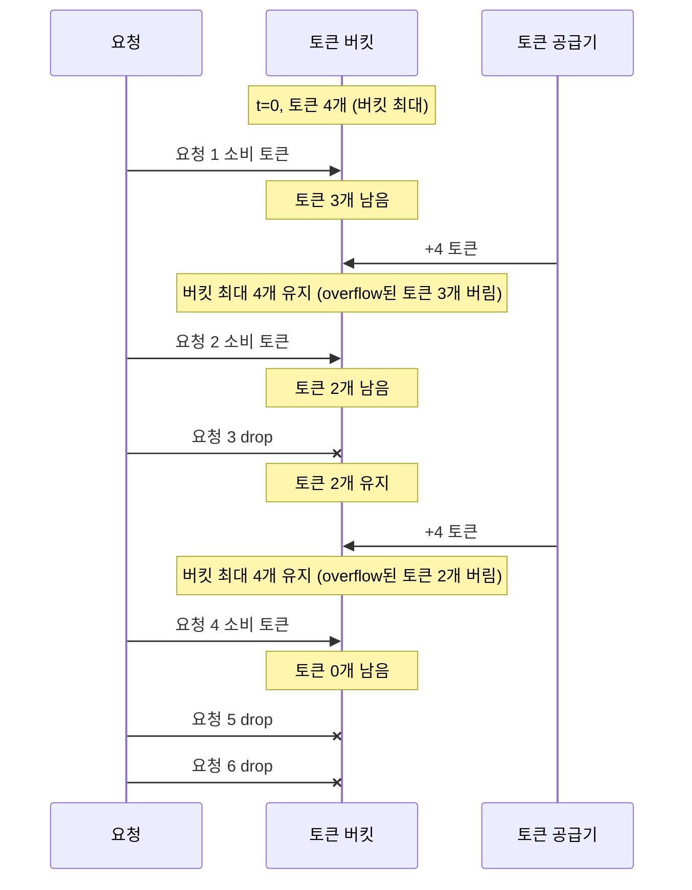
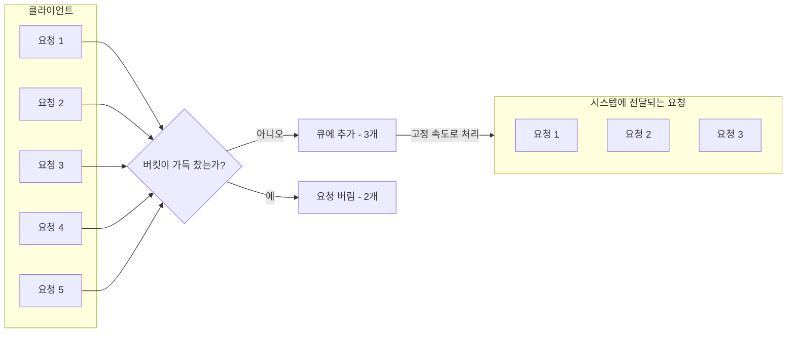

설계에 앞서, API에 처리율 제한 장치를 두면 좋은 점을 살펴보자.
* DoS 공격에 의한 자원 고갈을 방지할 수 있다.
* 비용을 절감한다.
  * 서버를 많이 두지 않아도 된다.
  * 우선순위가 높은 API에 더 많은 자원을 할당할 수 있다.
* 서버 과부하를 막는다. (트래픽 제어)

# 1단계 문제 이해 및 설계 범위 확정
면접관과 소통하여 어떤 제한 장치를 구현해야 하는지 정하자.

# 2단계 개략적 설계안 제시 및 동의 구하기
복잡함을 피하고, 기본적인 클라이언트-서버 통신 모델을 사용하도록 하자.

## 처리율 제한 장치는 어디에 둘 것인가?
* 클라이언트 측에 두기
  * 클라이언트의 요청은 쉽게 위변조가 가능해 안정적이지 못하다.
* API 서버 측에 두기
  ```mermaid
  flowchart LR
      Client[클라이언트] -->|HTTP 요청| APIServer[API 서버 / 처리율 제한 장치]
  ```
* 미들웨어로 두기
  * API 서버로 가는 요청을 통제함
  ```mermaid
  flowchart LR
    %% 클라이언트 → 미들웨어
    Client[클라이언트] --> Middleware[미들웨어 / 처리율 제한 장치]
    Client -->|X| Middleware
    Middleware -->|429: Too many requests| Client

    %% 미들웨어 → API 서버
    Middleware --> APIServer[API 서버]
    Middleware --> APIServer
  ```
  > 폭넓게 채택된 기술인 클라우드 마이크로서비스의 경우, 처리율 제한 장치는 보통 API 게이트웨이라 불리는 컴포넌트에 구현되며, 이를 API 게이트웨이 패턴이라고 부른다.

처리율 제한 서비스를 직접 만드는 데에 시간이 들기 때문에 구현할 인력이 충분치 않으면 사용 API 게이트웨이를 쓰는 것은 어떨까?

## 처리율 제한 알고리즘
널리 알려진 인기 처리율 제한 알고리즘은 아래와 같은 것들이 있다.
* 토큰 버킷
* 누출 버킷
* 고정 윈도 카운터
* 이동 윈도 로그
* 이동 윈도 카운터

### 토큰 버킷 (token bucket)
토큰 버킷은 지정된 용량을 갖는 컨테이너다.   
이 버킷에는 사전 설정된 양의 토큰이 주기적으로 채워진다.   
토큰이 꽉 찬 버킷에는 더 이상의 토큰은 추가되지 않는다.

용량이 4인 버킷에 토큰 공급기(refiller)는 매초 2개의 토큰을 추가한다.   
버킷이 가득 차면 추가로 공급된 토큰은 버려진다(overflow).

각 요청은 처리될 때마다 하나의 토큰을 사용한다.   
요청이 도착하면 버킷에 충분한 토큰이 있는지 검사하여, 충분한 경우에는 버킷에서 토큰 하나를 꺼낸 후 요청을 시스템에 전달하고, 없는 경우에는 해당 요청은 버려진다(dropped).

예시로 토큰 버킷의 크기는 4, 토큰 공급률은 분당 4인 토큰 버킷 알고리즘을 보자.

토큰 버킷 알고리즘은 2개의 파라미터를 받는다.
* 버킷 크기: 버킷에 담을 수 있는 토큰의 최대 개수
* 토큰 공급률: 초당 몇 개의 토큰이 버킷에 공급되는가

버킷은 몇 개나 사용해야 하나? 공급 제한 규칙에 따라 달라진다.
* 통상적으로, API endpoint마다 별도의 버킷을 둔다.
* IP 주소별로 처리율 제한을 적용해야 한다면 IP 주소마다 버킷을 하나씩 할당해야 한다.

장점과 단점은 아래와 같다.
* 장점
    * 구현이 쉽다.
    * 메모리 사용 측면에서도 효율적이다.
    * 짧은 시간에 집중되는 트래픽도 처리 가능하다.
* 단점
    * 버킷 크기와 토큰 공급률이라는 2개의 파라미터를 가지고 있는데, 이 값을 적절하게 튜닝하는 것은 까다로운 일이 될 것이다.

### 누출 버킷 알고리즘 (leaky bucket)
누출 버킷 알고리즘은 토큰 버킷 알고리즘과 비슷하지만, 요청 처리율이 고정되어 있다는 점이 다르다.

누출 버킷 알고리즘은 보통 FIFO 큐로 구현된다.
* 요청이 도착하면 큐가 가득 차 있는지 보고, 빈자리가 있는 경우에는 큐가 요청을 추가한다.
* 큐가 가득 차 있는 경우에는 새 요청은 버린다.
* 지정된 시간마다 큐에서 요청을 꺼내어 처리한다.


누출 버킷 알고리즘은 2개의 파라미터를 사용한다.
* 버킷 크기: 큐 사이즈와 같은 값으로, 큐에는 처리될 항목들이 보관된다.
* 처리율: 지정된 시간당 몇 개의 항목을 처리할지 지정하는 값으로, 보통 초 단위로 표현된다.

장점과 단점은 아래와 같다.
* 장점
    * 큐의 크기가 제한되어 있어 메모리 사용량 측명에서 효율적이다.
    * 고정된 처리율을 갖고 있기 때문에 안정적 출력이 필요한 경우 적합하다.
* 단점
* 큐가 가득 차 있는 경우에는 새 요청은 버린다.
* 2개의 인자를 올바르게 튜닝하기 까다로울 수 있다.

### 고정 윈도 카운터 (fixed window counter)
