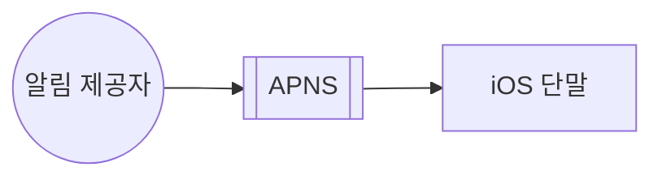
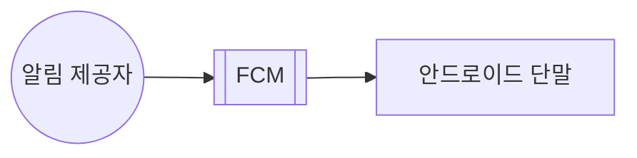
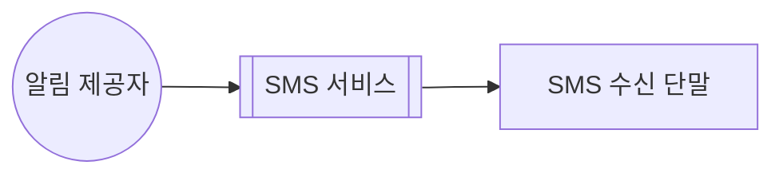
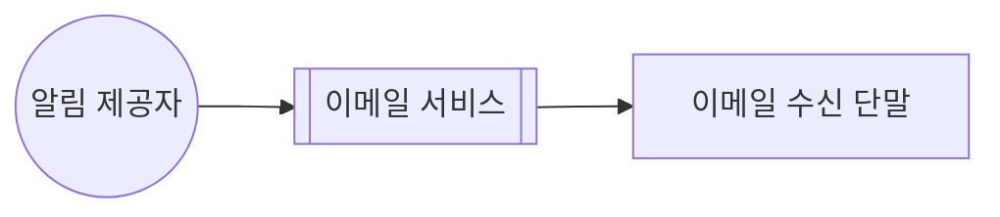
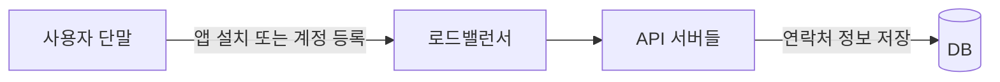
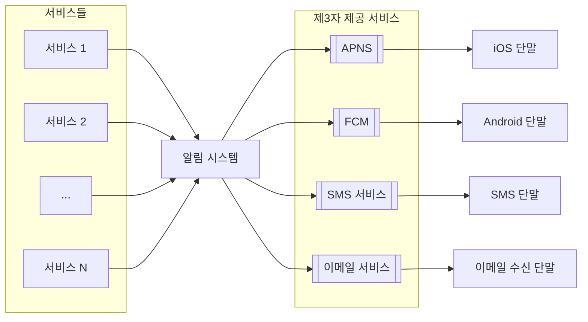
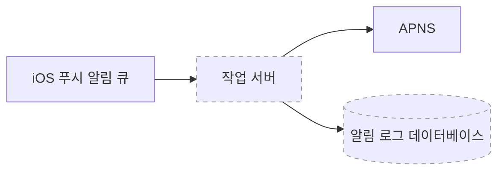

알림 시스템은 단순 히 모바일 푸시 알림에 한정되지 않는다.   
알림 시스템은 모바일 푸시 알림, SMS 메시지, 이메일의 세 가지로 분류할 수 있다.

# 1단계. 문제 이해 및 설계 범위 확정

적절한 질문을 통해 요구 사항이 무엇인지 지원자 스스로 알아내야 한다.
```
질문1: 이 시스템은 어떤 종류의 알림을 지원해야 하나요?
> 푸시 알림, SMS 메시지, 이메일

질문2: 실시간(real-time) 시스템이어야 하나요?
> 연성 실시간(soft real-time) 시스템이라고 가정
> 가능한 빨리, 부하 시 약간의 지연은 무방

질문3: 어떤 종류의 단말을 지원해야 하나요?
> iOS, android, 랩톱/데스크톱

질문4: 사용자에게 보낼 알림은 누가 만들 수 있나요?
> 클라이언트 애플리케이션 프로그램, 서버 측에서 스케줄링

질문5: 사용자가 알림을 받지 않도록(opt-out) 설정할 수도 있어야 하나요?
> 네

질문6: 하루에 몇 건의 알림을 보낼 수 있어야 하나요?
> 천만 건의 모바일 푸시 알림, 백만 건의 SMS 메시지, 5백만 건의 이메일
```

# 2단계. 개략적 설계안 제시 및 동의 구하기

## 알림 유형별 지원 방안

### 1. iOS 푸시 알림
iOS에서 푸시 알림을 보내기 위해서는 세 가지 컴포넌트가 필요하다.


> APNS: 애플이 제공하는 원격 서비스

### 2. 안드로이드 푸시 알림

> FCM(Firebase Cloud Messaging)

### 3. SMS 메시지

> 보통 상용 서비스로 Twilio, Nexmo 같은 제3사업자의 서비스를 많이 이용

### 4. 이메일

> 보통 상용 서비스로 Sendgrid, Mailchimp를 사용

## 연락처 정보 수집 절차
알림을 보내려면 모바일 단말 토큰, 전화번호, 이메일 주소 등의 정보가 필요하다.


## 알림 전송 및 수신 절차
개략적 설계안부터 점진적으로 최적화해 보자.

### 개략적 설계안 (초안)
* 1부터 N까지의 서비스
  * 마이크로서비스 or 크론잡 or 분산 시스템 컴포넌트
  * 예시
    * 사용자에게 납기일을 알리고자 하는 billing service
    * 배송 알림을 보내려는 쇼핑몰 서비스
* 알림 시스템
  * 알림 전송/수신 처리의 핵심
  * 1개 서버만 사용하는 시스템 (가정)
    * 서비스 1~N에 알림 전송을 위한 API 제공 필요
    * 제3자 서비스에 전달한 알림 payload 필요
* 제3자 서비스
  * 사용자에게 알림을 실제로 전달하는 역할
  * 확장성 유의
* iOS, android, SMS
  * 사용자는 자기 단말에서 알림을 수신



이 설계에는 아래와 같은 문제가 있다.
* SPOF(Single Point of Failure)
  * 알림 서비스에 서버가 하나밖에 없어서 장애가 생기면 전체 서비스의 장애로 이어진다.
* 규모 확장성
  * 한 대 서비스로 푸시 알림에 관계된 모든 것을 처리하므로,
  * DB나 cache 등 중요 컴포넌트의 규모를 개별적으로 늘릴 방법이 없다.
* 성능 병목
  * 사용자 트래픽이 많이 몰리는 시간에는 시스템이 과부하 상태에 빠질 수 있다.

### 개략적 설계안 (개선된 버전)
아래와 같은 방향으로 개선해 보자.
* DB와 cache를 알림 시스템의 주 서버에서 분리
* 알림 서버를 증설하고 자동으로 수평적 규모 확장 보장
* 메시지 큐를 이용해 시스템 컴포넌트 사이의 강한 결합 제거
> 알림 서버는 아래와 같은 기능을 제공한다.
> 
> * 알림 전송 API
> * 알림 검증
> * 데이터베이스 또는 캐시 질의
> * 알림 전송


1. API를 호출하여 알림 서버로 알림을 보낸다.
2. 알림 섬버는 사용자 정보, 단말 토큰, 알림 설정 같은 메타데이터를 캐시나 데이터베이스에서 가져온다.
3. 알림 서버는 전송할 알림에 맞는 이벤트를 만들어서 해당 이벤트를 위한 큐에 넣는다.
4. 작업 서버는 메시지 큐에서 알림 이벤트를 꺼낸다.
5. 작업 서버는 알림을 제3자 서비스로 보낸다.
6. 제3자 서비스는 사용자 단말로 알림을 전송한다.

# 3단계. 상세 설계
애래 내용을 좀 더 자세히 알아보자.
* 안정성(reliability)
* 추가로 필요한 컴포넌트 및 고려사항
  * 알림 템플릿
  * 알림 설정
  * 전송률 제한
  * 재시도 메커니즘
  * 보안
  * 큐에 보관된 알림에 대한 모니터링과 이벤트 추적
* 개선된 설계안

## 안정성
**분산 환경**에서 운영될 알림 시스템을 설계할 때는 안정성을 확보하기 위한 사항 몇 가지를 반드시 고려해야 한다.

### 데이터 손실 방지
데이터 손실 방지 요구사항을 만족하려면 알림 데이터를 DB에 보관하고 재시도 매커니즘을 구현해야 한다.


### 알림 중복 전송 방지
같은 알림이 여러 번 반복되는 것을 완전히 막는 것은 가능하지 않지만, 그 빈도를 줄이기 위해 중복을 탐지하는 메커니즘을 도입한다.
* 보내야 할 알림이 도착하면 그 이벤트 ID를 검사하여 이전에 본 적이 있는 이벤트인지 상핀다.
* 중복된 이벤트라면 버리고, 아니면 알림을 발송한다.

## 추가로 필요한 컴포넌트 및 고려사항
### 알림 템플릿
```
지금 [item_name]을 주문 또는 예약하세요!
```

### 알림 설정
사용자가 알림 설정을 상세히 조정할 수 있도록 알림 설정 테이블 사용

### 전송률 제한
한 사용자가 받을 수 있는 알림의 빈도를 제한

### 재시도 방법
제3자 서비스가 알림 전송에 실패하면, 해당 알림을 재시도 전용 큐에 넣는다.

같은 문제가 계속해서 발생하면 개발자에게 통지한다.

### 푸시 알림과 보안
App의 경우, 알림 전송 API는 appKey와 appSecret을 사용하여 보안을 유지한다. 

### 큐 모니터링
큐에 쌓인 알림의 metric 수가 너무 크면 작업 서버들이 이벤트를 빠르게 처리하고 있지 못하다는 뜻이므로, 작업 서버를 증설하는 게 바람직할 것이다.

### 이벤트 추적
알림 확인율, 클릭율, 실제 앱 사용으로 이어지는 비율 같은 메트릭은 사용자를 이해하는데 중요하다.

보통 알림 시스템을 만들면 데이터 분석 서비스와도 통합해야만 한다.


## 수정된 설계안


# 4단계. 마무리
알림은 중요 정보를 계속 알려준다는 점에서 필요불가결한 기능이다.

시스템 컴포넌트 사이의 결합도를 낮추기 위해 메시지 큐를 적극적으로 사용하였다.

각 컴포넌트의 구현 방법과 최적화 기법에 대해서 아래 주제에 집중하였다.
* 안정성(reliability)
  * 메시지 전송 실패율을 낮추기 위해 안정적인 재시도 메커니즘 도입
* 보안(security)
  * 인증된 클라이언트만이 알림을 보낼 수 있도록 appKey, appSecret 등의 메커니즘 이용
* 이벤트 추적 및 모니터링
  * 알림이 만들어진 후 성공적으로 전송되기까지의 과정을 추적하고 시스템 상태를 모니터링하기 위해 
  * 알림 전송의 각 단계마다 이벤트를 추적하고 모니터링할 수 있는 시스템을 통합
* 사용자 설정
  * 사용자가 알림 수신 설정을 조정할 수 있도록 설계
* 전송률 제한
  * 사용자에게 알림을 보내는 빈도를 제한
