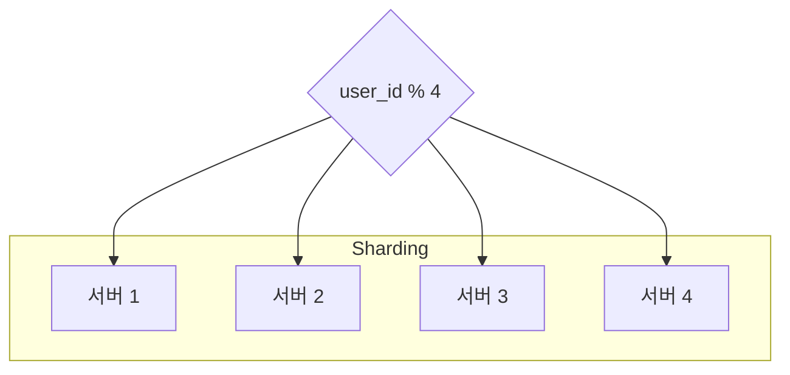

구글 드라이브는 파일 저장 및 동기화 서비스로,   
문서, 사진, 비디오, 기타 파일을 클라우드에 보관할 수 있도록 한다.

이 파일은 컴퓨터, 스마트폰, 태블릿 등 어떤 단말에서도 이용 가능해야 한다.

아울러 보관된 파일은 친구, 가족, 동료 들과 손쉽게 공유할 수 있어야 한다.

# 1단계. 문제 이해 및 설계 범위 확정
```
* 가장 중요하게 지원해야 할 기능들은?
>> 파일 업로드/다운로드, 파일 동기화, 알림(notification)

* 모바일 앱이나 웹 앱 가운데 어느 것을 지원하면 되나요?
>> 둘 다 지원

* 파일을 암호화해야 할까요?
>> 네

* 파일 크기에 제한이 있나요?
>> 10GB 제한

* 사용자는 얼마나 되나요?
>> 일간 능동 사용자(DAU) 기준으로 천만(10Million)명
```

이번 장에서는 아래 기능의 설계에 집중하자.
* 파일 추가
  * 가장 쉬운 방법은 파일을 구글 드라이브 안으로 떨구는(drag-and-drop) 것
* 파일 다운로드
* 여러 단말에 파일 동기화
  * 한 단말에서 파일을 추가하면 다른 단말에도 자동으로 동기화
* 파일 갱신 이력 조회(revision history)
* 파일 공유
* 파일이 편집되거나 삭제되거나 새롭게 공유되었을 때 알림 표시

기능적 요구사항 이외에, 아래 비-기능적 요구사항을 이해하는 것도 중요하다.
* 안정성
  * 저장소 시스템에서 안정성은 아주 중요하다.
  * 데이터 손실은 발생하면 안 된다.
* 빠른 동기화 속도
  * 파일 동기화에 시간이 너무 많이 걸리면 사용자는 인내심을 잃고 해당 제품을 더 이상 사용하지 않게 될 것이다.
* 네트워크 대역폭
  * 이 제품이 네트워크 대역폭을 불필요하게 많이 소모한다면 사용자는 좋아하지 않을 것이다.
  * 모바일 데이터 플랜을 사용하는 경우라면 더욱 그렇다.
* 규모 확장성
  * 이 시스템은 아주 많은 양의 트래픽도 처리 가능해야 한다.
* 높은 가용성
  * 일부 서버에 장애가 발생하거나, 느려지거나, 네트워크 일부가 끓겨도 시스템은 계속 사용 가능해야 한다.

## 개략적 추정치
* 가입 사용자는 5000만 명이고, 천만 명의 DAU 사용자가 있다고 가정
* 모든 사용자에게 10GB의 무료 저장공간 할당
* 매일 각 사용자가 평균 2개의 파일을 업로드한다고 가정.(각 파일의 평균 크기는 500KB)
* 읽기:쓰기 비율은 1:1
* 필요한 저장공간 총량 = 1000 만 사용자 X 2회 업로드 / 24시간 / 3600초 = 약 240
* 최대 QPS = QPS X 2 = 480

# 2단계. 개략적 설계안 제시 및 동의 구하기
모든 것을 담은 한 대 서버에서 출발해 점진적으로 천만 사용자 지원이 가능한 시스템으로 발전시켜 나가보자.

우선 아래와 같은 구성의 서버 한대로 시작해 보자.
* 파일을 올리고 다운로드 하는 과정을 처리할 웹 서버
* 사용자 데이터, 로그인 정보, 파일 정보 등의 메타데이터를 보관할 데이터베이스
* 파일을 저장할 저장소 시스템.(파일 저장을 위해 1TB의 공간을 사용)

## API
이 시스템은 기본적으로 세 가지 API가 필요하다.

1. 파일 업로드 API
   1. 단순 업로드: 파일 크기가 작을 때 사용 
   2. 이어 올리기: 파일 사이즈가 크고 네트워크 문제로 업로드가 중단될 가능성이 높다고 생각되는 경우에 사용
2. 파일 다운로드 API
3. 파일 갱신 히스토리 API

위 모든 API는 사용자 인증을 필요로 하고, HTTPS 프로토콜을 사용해야 한다.

SSL을 지원하는 프로토콜을 이용하는 이유는 클라이언트와 백엔드 서버가 주고받는 데이터를 보호하기 위한 것이다.

## 한 대 서버의 제약 극복
업로드되는 파일이 많아지다 보면 결국에는 파일 시스템은 가득 차게 된다.

드라이브의 여유 공간이 얼마 남지 않은 경우, 긴급히 문제를 해결해야 한다.

가장 먼저 떠오르는 해결책은 데이터를 sharding하여 여러 서버에 나누어 저장하는 것이다.

급한 불은 껐지만, 서버 장애 시 데이터 손실이 걱정된다.

규모 확장성, 가용성, 보안, 성능을 제공하는 객체 저장소 서비스인 S3를 사용해 보자.   
S3는 다중화를 지원하는데, 같은 지역 안에서도 가능하고 여러 지역에 걸쳐서도 가능하다.

여러 지역에 걸쳐 다중화하면 데이터 손실을 막고 가용성을 최대한 보장할 수 있다.   
S3 bucket은 마치 파일 시스템의 폴더와도 같은 것이다.


이제 데이터 손실 걱정은 없어지지만, 미래에 비슷한 문제가 벌어지는 것을 막기 위해 아래와 같이 개선할 부분을 보자.
* 로드밸런서
  * 네트워크 트래픽을 분산하기 위해 사용한다.
  * 트래픽을 고르게 분산할 수 있을 뿐 아니라, 특정 웹 서버에 장애가 발생하면 자동으로 해당 서버를 우회해준다.
* 웹 서버
  * 로드밸런서를 추가하고 나면 더 많은 웹 서버를 손쉽게 추가할 수 있다.
  * 따라서 트래픽이 폭증해도 쉽게 대응이 가능하다.
* 메타데이터 데이터베이스
  * 데이터베이스를 파일 저장 서버에서 분리하여 SPOF(Single Point of Failure)를 회피한다.
  * 아울러 다중화 및 샤딩 정책을 적용하여 가용성과 규모 확장성 요구사항에 대응한다.
* 파일 저장소
  * S3를 파일 저장소로 사용하고 가용성과 데이터 무손실을 보장하기 위해 두 개 이상의 지역에 데이터를 다중화한다.

이 모든 부분을 개선하고 나면 웹 서버, 메타데이터 데이터베이스, 파일 저장소가 한 대 서버에서 여러 서버로 잘 분리된다.


## 동기화 충돌
두 명 이상의 사용자가 같은 파일이나 폴더를 동시에 업데이트하려고 하는 경우, 때때로 동기화 충돌이 발생할 수 있다.

먼저 처리되는 변경은 성공한 것으로 보고, 나중에 처리되는 변경은 충돌이 발생한 것으로 표시하여 해소해 보자.


사용자 2가 충돌이 발생할 경우,   사용자 2가 가지고 있는 로컬 사본과 서버에 있는 최신 버전 두 파일을 사용자가 합칠지 아니면 둘 중 하나를 다른 파일로 대체할지를 결정해야 한다.

## 개략적 설계안


* 사용자 단말
  * 사용자가 이용하는 웹브라우저나 모바일 앱 등의 클라이언트
* 블록 저장소 서버(block server)
  * 파일 블록을클라우드 저장소에 업로드하는 서버
  * 클라우드 환경에서 데이터 파일을 저장하는 기술
  * 이 저장소는 파일을 여러 개의 블록으로 나눠 저장하며, 각 블록에는 고유한 해시값이 할당된다.
  * 이 해시값은 메타데이터 데이터베이스에 저장된다.
  * 각 블록은 독립적인 객체로 취급되며 클라우드 저장소 시스템(S3)에 보관된다.
  * 파일을 재구성하려면 블록들을 원래 순서대로 합쳐야 한다.
* 클라우드 저장소
  * 파일을 블록 단위로 나눠져 클라우드 저장소에 보관된다.
* 아카이빙 저장소(cold storage)
    * 오랫동안 사용되지 않은 비활성 데이터를 저장하기 위한 컴퓨터 시스템
* 로드밸런서
  * 요청을 모든 API 서버에 고르게 분산한다.
* API 서버
  * 파일 업로드 외에 거의 모든 것을 담당하는 서버
  * 사용자 인증, 사용자 프로파일 관리, 파일 메타데이터 갱신 등에 사용된다.
* 메타데이터 데이터베이스
  * 사용자, 파일, 블록, 버전 등의 메타데이터 정보를 관리
  * 실제 파일은 클라우드에 보관
* 메타데이터 캐시
  * 성능을 높이기 위해 자주 쓰이는 메타데이터는 캐시한다.
* 알림 서비스
  * 특정 이벤트가 발생했음을 클라이언트에게 알리는데 쓰이는 발생/구독 프로토콜 기반 시스템
  * 클라이언트에게 파일이 추가, 편집, 삭제되었음을 알려, 파일의 최신 상태를 확인하도록 하는 데 쓰인다.
* 오프라인 사용자 백업 큐
  * 클라이언트가 접속 중이 아니라서 파일의 최신 상태를 확인할 수 없을 때는 해당 정보를 이 큐에 두어 나중에 클라이언트가 접속했을 때 동기화

# 3단계. 상세 설계
블록 저장소 서버, 메타데이터 데이터베이스, 업로드 절차, 다운로드 절차, 알림 서비스, 파일 저장소 공간 및 장애 처리 흐름에 대해 좀 더 자세히 알아보자.

## 블록 저장소 서버
정기적으로 갱신되는 큰 파일들은 업데이트가 일어날 때마다 전체 파일을 서버로 보내면 네트워크 대역폭을 많이 잡아먹게 된다.

이를 최적화하는 방법으로는 아래 두 가지 정도가 있다.

* 델타 동기화
  * 파일이 수정되면 전체 파일 대신 수정이 일어난 블록만 동기화
* 압축
  * 블록 단위로 압축해 두면 데이터 크기를 많이 줄일 수 있다.
  * 이때 압축 알고리즘은 파일 유형에 따라 정한다.

이 시스템에서 블록 저장소 서버는 클라이언트가 보낸 파일을 블록 단위로 나눠야 하고, 각 블록에 압축 알고리즘을 적용해야 하고, 암호화까지 해야 한다.

아울러 전체 파일을 저장소 시스템으로 보내는 대신 수정된 블록만 전송해야 한다.

새 파일이 추가되었을 때 블록 저장소 서버가 어떻게 동작하는지 보자.


* 주어진 파일을 작은 블록들로 분할
* 각 블록을 압축
* 클라우드 저장소로 보내기 전에 암호화
* 클라우드 저장소로 전송

아래 그림은 델타 동기화 전략이 어떻게 동작하는지를 보여준다.   
갱신된 부분만 클라우드 저장소에 업로드하여 동기화한다.


블록 저장소 서버에 델타 동기화 전략과 압축 알고리즘을 도입하였으므로, 네트워크 대역폭 사용량을 절감할 수 있다.

## 높은 일관성 요구사항
이 시스템은 강한 일관성 모델을 기본으로 지원해야 한다.

메모리 캐시는 보통 결과적 일관성 모델을 지원한다.   
따라서 강한 일관성을 달성하려면 다음 사항을 보장해야 한다.

* 캐시에 보관된 사본과 데이터베이스에 있는 원본이 일치한다.
* 데이터베이스에 보관된 원본에 변경이 발생하면 캐시에 있는 사본을 무효화한다.

> RDBMS는 ACID를 보장하므로 강한 일관성을 보장하기 쉽다.   
> NoSQL은 이를 기본으로 지원하지 않는다.

## 업로드 절차


* 파일 메타데이터 추가
  ```
  1. 클라이언트 1이 새 파일의 메타데이터를 추가하기 위한 요청 전송
  2. 새 파일의 메타데이터를 데이터베이스에 저장하고 업로드 상태를 대기중(pending)으로 변경
  3. 새 파일이 추가되었음을 알림 서비스에 통지
  4. 알림 서비스는 관련된 클라이언트에게 파일이 업로드되고 있음을 알림
  ```
* 파일을 클라우드 저장소에 업로드
  ```
  2.1 클라이언트 1이 파일을 블록 저장소 서버에 업로드
  2.2 블록 저장소 서버는 파일을 블록 단위로 쪼갠 다음 압축하고 암호화 한 다음에 클라우드 저장소에 전송
  2.3 업로드가 끝나면 클라우드 스토리지는 완료 콜백을 호출. 이 콜백 호출은 API 서버로 전송됨
  2.4 메타데이터 DB에 기록된 해당 파일의 상태를 완료(uploaded)로 변경
  2.5 알림 서비스에 파일 업로드가 끝났음을 통지
  2.6 알림 서비스는 관련된 클라이언트에게 파일 업로드가 끝났음을 알림
  ```

## 다운로드 절차
파일 다운로드는 파일이 새로 추가되거나 편집되면 자동으로 시작된다.

클라이언트는 다른 클라이언트가 파일을 편집하거나 추가했다는 사실을 어떻게 감지할까?   
아래 두 가지 방법을 사용한다.

* 클라이언튼 A가 접속 중이고 다른 클라이언트가 파일을 변경하면 알림 서비스가 클라이언트 A에게 변경이 발생했으니 새 버전을 끌어가야 한다고 알린다.
* 클라이언트 A가 네트워크에 연결된 상태가 아닐 경우에는 데이터는 캐시에 보관될 것이다. 해당 클라이언트의 상태가 접속 중으로 바뀌면 그때 해당 클라이언트는 새 버전을 가져갈 것이다.

어떤 파일이 변경되었음을 감지한 클라이언트는 우선 API 서버를 통해 메타데이터를 새로 가져가야 하고, 그 다음에 블록들을 다운받아 파일을 재구성해야 한다.


1. 알림 서비스가 클라이언트 2에게 누군가 파일을 변경했음을 알림
2. 알림을 확인한 클라이언트 2는 새로운 메타데이터를 요청
3. API 서버는 메타데이터 데이터베이스에게 새 메타데이터 요청
4. API 서버에게 새 메타데이터가 반환됨
5. 클라이언트 2에게 새 메타데이터가 반환됨
6. 클라이언트 2는 새 메타데이터를 받는 즉시 블록 다운로드 요청 전송
7. 블록 저장소 서버는 클라우드 저장소에서 블록 다운로드
8. 클라우드 저장소는 블록 서버에 요청된 블록 반환
9. 블록 저장소 서버는 클라이언트에게 요청된 블록 반환. 클라이언트 2는 전송된 블록을 사용하여 파일 재구성

## 알림 서비스
알림 서비스는 이벤트 데이터를 클라이언트들로 보내느 서비스다.   
따라서 다음 두 가지 정도의 선택지가 있다.

* long polling
  * 드롭박스가 이 방식을 채택하고 있다.
* WebSocket
  * 클라이언트와 서버 사이에 지속적인 통신 채널을 제공한다. 따라서 양방향 통신이 가능하다.

이 시스템에서는 long polling을 사용하자. 이유는 아래와 같다.
* 채팅 서비스와는 달리, 알림 서비스와 양방향 통신이 필요하지 않다.
  * 즉 서버는 파일이 변경된 사실을 클라이언트에게 알려주어야 하지만 반대 방향의 통신은 요구되지 않는다.
* WebSocket은 실시간 양방향 통신이 요구되는 채팅 같은 응용에 적합하다.
  * 따라서 구글 드라이브의 경우 알림을 보낼 일은 그렇게 자주 발생하지 않으며, 알림을 보내야 하는 경우에도 단시간에 많은 양의 데이터를 보낼 일은 없다.

long polling 방안을 쓰게 되면 각 클라이언트는 알림 서버와 롱 폴링용 연결을 유지하다가 특정 파일에 대한 변경을 감지하면 해당 연결을 끊는다.   
이때 클라이언트는 반드시 메타데이터 서버와 연결해 파일의 최신 내역을 다운로드 해야한다.

해당 다운로드 작업이 끝났거나 연결 타임아웃 시간에 도달한 경우에는 즉시 새 요청을 보내어 long polling 연결을 복원하고 유지해야 한다.

## 저장소 공간 절약
파일 갱신 이력을 보존하고 안정성을 보장하기 위해서는 파일의 여러 버전을 여러 데이터센터에 보관할 필요가 있다.

모든 버전을 자주 백업하게 되면 저장용량이 너무 빨리 소진될 가능성이 있다.   
이런 문제를 피하고 비용을 절감하기 위해서는 보통 아래 세 가지 방법을 사용한다.
* 중복 제거(de-dupe)
  * 중복된 파일 블록을 계정 차원에서 제거하는 방법이다.
  * 두 블록이 같은 블록인지는 해시 값을 비교하여 판단한다.
* 지능적 백업 전략을 도입한다.
  * 한도 설정: 보관해야 하는 파일 버전 개수에 상한을 두고, 상한에 도달하면 제일 오래된 버전은 버린다.
  * 중요한 버전만 보관: 아주 자주 바뀌는 파일의 경우, 여러 버전들 중 중요한 것만 골라내야 한다.
* 자주 쓰이지 않는 데이터는 아카이빙 저장소(cold storage)로 옮긴다.
  * 아마존 S3 glacier 같은 아카이빙 저장소 이용료는 S3보다 훨씬 저렴하다.

## 장애 처리
* 로드밸런서 장애
  * 부(secondary) 로드밸런서가 활성화되어 트래픽을 이어받아야 한다.
  * 로드밸런서끼리는 보통 heartbeat 신호를 주기적응로 보내서 상태를 모니터링한다.
  * 일정 시간동안 heartbeat 신호에 응답하지 않은 로드밸런서는 장애가 발생한 것으로 간주한다.
* 블록 저장소 서버 장애
  * 블록 저장소 서버에 장애가 발생했다면 다른 서버가 미완료 상태 또는 대기 상태인 작업을 이어받아야 한다.
* 클라우드 저장소 장애
  * S3 bucket은 여러 지역에 다중화할 수 있으므로, 한 지역에서 장애가 발생하면 다른 지역에서 파일을 가져오면 된다.
* API 서버 장애
  * API 서버들은 무상태 서버다.
  * 따라서 로드밸런서는 API 서버에 장애가 발생하면 트래픽을 해당 서버로 보내지 않음으로써 장애 서버를 격리할 것이다.
* 메타데이터 캐시 장애
  * 메타데이터 캐시 서버도 다중화한다.
  * 따라서 한 노드에 장애가 생겨도 다른 노드에서 데이터를 가져올 수 있다.
  * 장애가 발생한 서버는 새 서버로 교체하면 된다.
* 메타데이터 데이터베이스 장애
  * 주 데이터베이스 서버 장애
    * 부 데이터베이스 서버 가운데 하나를 주 데이터베이스 서버로 바꾸고, 부 데이터베이스 서버를 새로 하나 추가한다.
  * 부 데이터베이스 서버 장애
    * 다른 부 데이터베이스 서버가 읽기 연산을 처리하도록 하고 그동안 장애 서버는 새 것으로 교체한다.
* 알림 서비스 장애
  * 접속 중인 모든 사용자는 알림 서버와 long polling 연결을 하나씩 유지한다.
  * 따라서 많은 사용자와의 연결을 유지하고 관리해야 한다.
  * 한 대 서버에 장애가 발생하면 100만 명 이상의 사용자가 long polling 연결을 다시 만들어야 한다.
  * 주의할 것은 한 대 서버로 100만 개 이상의 접속을 유지하는 것은 가능하지만, 동시에 100만 개 접속을 '시작'하는 것은 불가능하다는 점이다.
  * 따라서 long polling 연결을 복구하는 것은 상대적으로 느릴 수 있다.
* 오프라인 사용자 백업 큐 장애
  * 다중화해 두어야 한다.
  * 큐에 장애가 발생하면 구독 중인 클라이언트들은 백업 큐로 구독 관계를 재설정해야 할 것이다.

# 4단계. 마무리
이번 장에서 만든 설계안은 크게 두 가지 부분으로 구성된다.

* 파일의 메타데이터를 관리하는 부분
* 파일 동기화를 처리하는 부분

알림 서비스는 이 두 부분과 병존하는 또 하나의 중요 컴포넌트다.   
long polling을 사용하여 클라이언트로 하여금 파일의 상태를 최신으로 유지할 수 있도록 한다.
